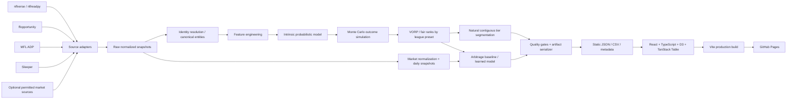

# Fantasy Draft Intelligence — Master Build Specification

> Generated coding-agent handoff. This is the single-file representation of the full multi-file specification bundle.
> The multi-file bundle remains canonical for implementation because `AGENTS.md`, configs, and schemas are intended to live at their repository paths.

## How to use this file

A capable coding agent can use this file as its initial context when file-bundle ingestion is inconvenient. Before implementation, recreate or preserve the paths named in each section. Follow `AGENTS.md` as the canonical execution policy, `TASKS.md` as the phased checklist, and `SESSION_STATE.md` as the resumable state ledger.

---

# Bundled file: `README.md`

# Fantasy Draft Intelligence — Coding-Agent Handoff Bundle

This bundle is the source-of-truth specification for building a public, daily-refreshed fantasy-football draft intelligence website that materially improves on the product pattern popularized by `borisachen/fftiers`.

The product has two analytically separate outputs:

1. **Intrinsic Tier Board** — model player value without using ADP/ECR as inputs, quantify uncertainty, convert outcomes to league-aware value above replacement, and discover natural contiguous tiers.
2. **Draft Arbitrage Board** — compare intrinsic value to observed draft-market cost and rank mispricings using historically validated surplus modeling.

The intended production architecture is static and GitHub-native: Python data/model pipelines + GitHub Actions + React/TypeScript/Vite + D3 + TanStack Table + GitHub Pages. No runtime backend is required for V1.

## What is in this bundle

| File | Purpose |
|---|---|
| `PRD.md` | Canonical product requirements and launch criteria |
| `AGENTS.md` | Canonical coding-agent operating instructions |
| `CLAUDE.md` | Thin Claude Code bridge to `AGENTS.md` |
| `PROMPT_START_HERE.md` | Copy/paste bootstrap prompt for a frontier coding agent |
| `TASKS.md` | Phase-gated implementation checklist |
| `SESSION_STATE.md` | Cross-session state template |
| `docs/ARCHITECTURE.md` | System architecture, repo shape, execution paths |
| `docs/DATA_SOURCES.md` | Source registry, legal/availability gates, fallbacks |
| `docs/DATA_CONTRACTS.md` | Canonical entities, IDs, schemas, validation rules |
| `docs/MODELING.md` | Tier and arbitrage modeling methodology and evaluation |
| `docs/UX_SPEC.md` | Detailed visual/product behavior |
| `docs/IMPLEMENTATION_PLAN.md` | Methodical build phases with exit gates |
| `docs/TEST_STRATEGY.md` | Unit/integration/data/model/UI/E2E test requirements |
| `docs/OPERATIONS.md` | Actions cadence, failure handling, observability, reproducibility |
| `docs/SECURITY_LICENSE.md` | Secrets, permissions, dependency, licensing, attribution rules |
| `docs/DECISIONS.md` | Architecture decision record index |
| `docs/AGENT_MODEL_NOTES.md` | Current frontier-agent capabilities and harness guidance |
| `config/league-defaults.yaml` | Supported league/scoring presets |
| `config/source-registry.yaml` | Machine-readable source policy registry |
| `schemas/*.schema.json` | Public artifact contract schemas |
| `repo-tree.txt` | Target repository structure |
| `MASTER_SPEC.md` | Concatenated human/agent-readable master specification |

## How to use this with a coding agent

1. Put this bundle at the root of a new repository.
2. Give the agent `PROMPT_START_HERE.md` as the initial task.
3. The agent must read `AGENTS.md`, `PRD.md`, `TASKS.md`, and the relevant docs before touching code.
4. The agent must implement phases in order and satisfy each exit gate before progressing.
5. The agent must update `TASKS.md` and `SESSION_STATE.md` after every meaningful phase or handoff.
6. Source/API uncertainty must be resolved in Phase 0. The agent may not invent endpoints, licenses, historical coverage, or model results.

## Product defaults

- Audience: redraft fantasy-football players preparing draft-day sheets.
- Core positions: QB, RB, WR, TE. K and D/ST are a non-blocking extension after the core launch.
- Scoring: Standard, Half-PPR, PPR.
- Default league: 12 teams, 1 QB, 2 RB, 2 WR, 1 TE, 2 FLEX, 5 bench.
- Core model independence rule: **ADP, ECR, expert ranks, market prices, and FantasyCalc values are forbidden inputs to the intrinsic projection/tier model.**
- Cadence: daily public refresh; weekly/manual model retraining during active draft season.
- Hosting: GitHub Pages.
- Cost target: $0 recurring infrastructure cost using public/free data and standard GitHub-hosted runners in a public repository.

## Definition of “better than fftiers”

The product is not considered successful merely because it looks newer. It must improve along four measurable dimensions:

1. **Method:** intrinsic projections and uncertainty, rather than clustering average expert rank alone.
2. **Validation:** rolling out-of-time model evaluation with baselines, calibration, leakage tests, and published metrics.
3. **Actionability:** explicit market-vs-model arbitrage and expected-surplus ranking.
4. **Product utility:** interactive tier/arbitrage visualizations, sortable/filterable tables, exports, freshness/quality indicators, and reproducible daily updates.

See `PRD.md` for binding acceptance criteria.

---

# Bundled file: `PRD.md`

# Product Requirements Document — Fantasy Draft Intelligence

**Status:** Build-ready specification  
**Version:** 1.0  
**Primary use case:** 2026+ redraft fantasy-football draft preparation  
**Deployment target:** Public GitHub Pages site with daily GitHub Actions refreshes

## 1. Executive summary

Build a public, zero-backend fantasy-football draft intelligence product with two complementary analytical systems:

- **Tier Board:** estimate each player's intrinsic fantasy value and uncertainty from football data only, translate that into league-aware value above replacement, then discover natural contiguous tiers and render them as a clean interactive S-tier-style draft board.
- **Arbitrage Board:** independently observe what the fantasy market is paying for players, then identify and rank discrepancies between intrinsic value and market cost. When sufficient historical market data exists, predict realized draft surplus out-of-time; otherwise launch a transparent deterministic market-gap baseline until the ML gate is passed.

The product must be useful as a draft-day sheet: fast, readable, sortable, filterable, exportable, explainable, and fresh. The website must remain static at runtime. Data acquisition, feature engineering, model training/inference, validation, artifact generation, and deployment occur in GitHub Actions.

## 2. Problem statement

Traditional expert-consensus tier products often group players by rank or consensus dispersion. They are useful summaries of expert opinion but do not independently estimate player outcomes, positional replacement value, or market mispricing.

This product should answer two different questions without conflating them:

1. **Intrinsic question:** "Given the football evidence available today, what is this player worth in my league?"
2. **Market question:** "Given that intrinsic value, is the current draft market overpaying or underpaying for him?"

The separation is non-negotiable. Market information entering the intrinsic model would weaken the causal/analytical distinction and make arbitrage circular.

## 3. Goals

### 3.1 Product goals

- Produce daily-updated pre-draft rankings and natural tiers for QB/RB/WR/TE.
- Produce daily-updated arbitrage rankings using at least one verified market ADP source.
- Support Standard, Half-PPR, and PPR scoring at launch.
- Support at least 10-, 12-, and 14-team 1QB redraft presets; 8-team support is desirable.
- Let users explore the visualizations, search/filter/sort tables, and export data.
- Make every public number traceable to a build timestamp, model version, league configuration, and source status.
- Keep recurring infrastructure cost at $0 for the default public deployment.
- Make the repository reproducible and highly legible to future coding agents and human contributors.

### 3.2 Analytical goals

- Produce calibrated probabilistic player outcome estimates, not only point estimates.
- Compute positional scarcity from modeled outcomes and league roster structure, not ADP.
- Discover tiers from the modeled value distributions without preselecting a fixed number of tiers.
- Validate models with rolling, time-aware holdouts.
- Prevent all temporal and market leakage through automated tests.
- Demonstrate that the final model beats declared naive baselines and that the arbitrage model beats a simple rank-gap baseline before claiming ML superiority.

### 3.3 UX goals

- Utility-first, minimalist interface; no decorative dashboard clutter.
- Immediate readability at laptop/tablet draft-table distance.
- Charts must expose useful structure that a normal ranked list hides.
- Tables must be first-class, not an afterthought.
- Mobile must be usable, but desktop/tablet draft use is the primary layout target.

## 4. Non-goals for V1

- Live draft-room synchronization or automated picks.
- User accounts, authentication, cloud database, or personalized persistent server state.
- Dynasty rankings.
- DFS optimization.
- Weekly start/sit rankings.
- Betting/prop recommendations.
- Natural-language news sentiment models.
- Paid-data dependency.
- Scraping sites whose terms or robots/usage policy do not permit the intended use.
- Marketing copy, articles, community features, ads, or social features.

Kicker and D/ST rankings are desirable compatibility additions but must not delay the core QB/RB/WR/TE launch.

## 5. Personas and jobs to be done

### Primary persona: prepared redraft manager

Needs a trustworthy draft sheet that goes beyond consensus, quickly shows tier cliffs, highlights value pockets, and can be exported or kept open during a draft.

Key jobs:

- "Show me who belongs in the same decision set at my current pick."
- "Show me where a tier cliff is coming."
- "Show me which players the market is meaningfully undervaluing."
- "Show me the uncertainty so I know whether the model has conviction."
- "Let me filter to a position and scoring format instantly."
- "Let me download the current table before my draft."

### Secondary persona: analytically curious fantasy player

Needs methodology, model performance, source freshness, and transparent explanation without requiring a notebook.

## 6. Functional requirements

### FR-001 — League configuration

The UI must expose at minimum:

- scoring: `STD`, `HALF`, `PPR`
- league size: `10`, `12`, `14` teams; `8` if supported by final artifact size/performance
- position filter: `ALL`, `QB`, `RB`, `WR`, `TE`

The default configuration is defined in `config/league-defaults.yaml`.

V1 does not allow arbitrary scoring rules. The architecture must not prevent a future custom-scoring calculator.

### FR-002 — Daily data refresh

A scheduled workflow must:

1. fetch/refresh permitted current sources;
2. validate schemas and source freshness;
3. resolve player identity;
4. build current features;
5. run production model inference;
6. perform deterministic Monte Carlo simulation;
7. compute VORP and tiers for supported presets;
8. fetch/normalize market data;
9. compute arbitrage outputs;
10. validate public artifacts;
11. build the frontend;
12. deploy only if all critical gates pass.

If a critical source fails, the last-known-good production site stays live. Never deploy corrupt, empty, or partially joined data just to satisfy cadence.

### FR-003 — Intrinsic Tier Board

The board must display natural contiguous tiers using visual labels beginning with `S`, then `A`, `B`, `C`, etc.

Each player mark/card must expose:

- player name
- team
- position and positional rank
- overall fair rank
- tier
- median or mean DraftValue/VORP
- floor and ceiling indicators (at least P25/P75; P10/P90 in detail view)
- uncertainty/volatility indicator
- model confidence/data-quality flag if applicable

The visualization must communicate distance within a tier, not merely place equal-sized cards in rows.

### FR-004 — Arbitrage Board

The board must compare intrinsic fair cost to market draft cost and visually encode the size and direction of the pricing gap.

At minimum expose:

- player
- position
- fair/model rank or fair pick
- market ADP
- market ADP spread if source provides it
- raw rank gap
- expected surplus VORP if the ML model passes promotion gates
- arbitrage score percentile 0–100
- probability of positive surplus when available
- confidence
- trend/change versus previous daily snapshot when enough snapshots exist

Positive value must be visually distinguishable from overvalued players without relying on color alone.

### FR-005 — Data tables

Both Tier and Arbitrage views must have associated sortable/filterable tables.

Required behaviors:

- stable multi-column sort
- text search
- position filter
- league/scoring preset filter
- numeric range filtering for key value columns where practical
- sticky table header
- column tooltips or concise glossary
- deterministic default sort
- no pagination requirement for <= 400 rows; virtualization optional

### FR-006 — Export

Users must be able to:

- download the full current tier dataset as CSV;
- download the full current arbitrage dataset as CSV;
- export the currently filtered table view as CSV client-side;
- see model/build date in exported files or accompanying metadata.

### FR-007 — Methodology and provenance

The site must expose a compact methodology/source panel with:

- last successful refresh timestamp
- production model version(s)
- public build SHA if available
- source status/freshness summary
- concise explanation of Tier Board vs Arbitrage Board
- explicit statement that ADP/ECR are not intrinsic-model features
- links/attributions required by data licenses

### FR-008 — URL state

Scoring format, league size, primary tab, position filter, and optional player search should be serializable into URL query parameters so a view can be bookmarked/shared without a backend.

### FR-009 — Accessibility

- Keyboard-accessible interactive controls.
- WCAG AA contrast target for text and important marks.
- Do not encode tier or arbitrage direction by hue alone; use labels, position, line direction, icons, or pattern/weight as secondary channels.
- Tooltips must have an accessible equivalent.
- Respect `prefers-reduced-motion`.

### FR-010 — Performance

Target on a normal broadband desktop:

- initial compressed JS/CSS/data payload kept intentionally modest; avoid shipping raw historical data to the browser;
- chart interactions remain responsive with at least 300 player records;
- no runtime API calls are required for the core experience;
- Lighthouse performance/accessibility regressions should be monitored in CI if stable enough.

## 7. Data requirements

### 7.1 Required data categories

**Football performance/history**

- weekly/season player statistics
- play-by-play-derived opportunity where useful
- rosters/team status
- historical/current depth charts
- draft capital
- combine/athletic measures where available
- age/experience
- Next Gen / advanced statistics where legally and temporally available
- expected fantasy opportunity (`ffopportunity`) where available

**Current-state context**

- current roster/team
- current depth-chart position
- current injury/status data from an allowed source

**Market data**

- current ADP with sample size and dispersion where possible
- daily snapshots retained during draft season
- historical ADP/draft-cost coverage sufficient for arbitrage ML training, or transparent fallback to a deterministic gap model

### 7.2 Source priority

Primary free stack target:

1. nflverse/nflreadpy
2. ffopportunity through nflreadpy/ffverse
3. verified MyFantasyLeague ADP endpoint(s)
4. Sleeper public API for current player/status sanity and optional trending
5. FantasyCalc only if its current terms fit the deployment's non-commercial status and the access method is permitted

FantasyPros-derived ECR may be used for internal benchmarking only if current terms permit the exact usage. It must not become a hidden production dependency.

See `docs/DATA_SOURCES.md`.

### 7.3 Identity requirement

Never join datasets solely on player name in a production transformation.

Preferred canonical ID is `gsis_id` where available. Maintain crosswalks for Sleeper/MFL/ESPN/etc. Name-based fuzzy matching may exist only in an explicit staging resolver that emits unresolved/ambiguous records for review; it must never silently choose among ambiguous players.

## 8. Intrinsic model requirements

Binding rules:

- market/expert data are prohibited features;
- all training examples must represent a reproducible draft-time information cutoff;
- validation is rolling/time-aware, never random player-season splitting across future/past;
- output must be probabilistic or quantile-based;
- direct total-points baseline and more sophisticated availability × performance candidate must both be evaluated before choosing production complexity;
- model choice is metric-driven, not architecture-driven;
- deterministic seeds and versioned feature schemas are required;
- model artifact promotion requires published validation metrics and leakage checks.

Core outputs per player/scoring preset:

- expected fantasy points
- P10/P25/P50/P75/P90 fantasy points or equivalent simulated quantiles
- expected/median VORP
- VORP quantiles
- fair overall rank
- positional rank
- uncertainty
- optional games-played distribution

## 9. Replacement value and DraftValue requirements

Replacement value must derive from modeled outcomes and the league's roster structure, not ADP.

For each simulation and league preset:

1. allocate required starting QB/RB/WR/TE slots across all teams;
2. allocate FLEX slots to the best eligible remaining RB/WR/TE outcomes;
3. define positional replacement baseline from the best player remaining after starter/FLEX allocation (with a documented deterministic tie rule);
4. compute each player's VORP against the position-appropriate replacement baseline for that simulation.

Overall intrinsic ranking defaults to expected/median VORP. Any future risk-adjusted ranking must be explicit and user-selectable rather than silently embedding subjective upside preference.

## 10. Tiering requirements

Tiers must be contiguous in fair-rank order and derived from the simulated VORP distributions.

The production algorithm may use multidimensional change-point segmentation (recommended initial candidate: PELT/RBF on normalized distribution summaries) or another statistically defensible contiguous segmentation method.

The number of tiers must not be manually fixed per position.

Promotion requirements:

- bootstrap stability test;
- sensitivity test to reasonable penalty/hyperparameter perturbations;
- monotonic tier ordering on holdout actual VORP;
- no pathological singleton proliferation; legitimate statistically isolated S-tier singletons are allowed;
- documented minimum/maximum display handling for deep ranks.

See `docs/MODELING.md`.

## 11. Arbitrage model requirements

### 11.1 Strict separation

The arbitrage pipeline may consume intrinsic model outputs and market data. The intrinsic pipeline may not consume arbitrage/market data.

### 11.2 Historical target

Preferred realized target:

`realized_surplus_vorp = actual_player_vorp - expected_actual_vorp_for_players_drafted_near_that_market_cost`

The expected market-cost curve must be estimated only from information/training seasons allowed by the rolling evaluation fold.

### 11.3 Historical intrinsic features

When training the arbitrage model, historical intrinsic predictions must be **out-of-fold / rolling-origin predictions**. Never feed a historical player a DraftValue prediction produced by a model trained on that player's target season.

### 11.4 ML feasibility gate

Before calling the arbitrage system "ML":

- verify sufficient historical ADP coverage and stable identifiers;
- define at least three chronological holdout seasons when available;
- compare against simple `ADP - fair_rank` and fair-value-only baselines;
- require improvement on declared metrics.

If the historical market dataset fails this gate, V1 launches a transparent deterministic arbitrage score using fair rank vs market ADP, ADP dispersion, and market trend. It must be labeled baseline/heuristic, not ML.

### 11.5 Output

- fair rank / fair pick
- market ADP
- ADP spread/sample size where possible
- fair-vs-market gap
- expected surplus VORP (only after ML promotion)
- `p_positive_surplus` (only after calibrated model promotion)
- arbitrage percentile score
- market trend
- confidence/data sufficiency flag

## 12. Evaluation framework

### 12.1 Intrinsic ranking/projection metrics

At minimum:

- MAE/RMSE on fantasy points for point-estimate baselines
- pinball loss for modeled quantiles
- interval coverage for P10–P90 / P25–P75
- Spearman rank correlation of predicted DraftValue vs realized VORP
- Kendall tau as a secondary rank metric
- NDCG or top-K utility metric for the most draft-relevant ranks
- positional calibration/error slices
- rookie vs veteran slices
- bootstrap confidence intervals around material comparisons

### 12.2 Tier metrics

- tier bootstrap stability (e.g. adjusted Rand index or boundary agreement)
- holdout actual-VORP monotonicity by tier
- within-tier vs between-tier separation
- rate of unstable boundaries under perturbation

### 12.3 Arbitrage metrics

- Spearman/information coefficient between predicted and realized surplus
- MAE/RMSE if predicting continuous surplus
- Brier/log loss and calibration if predicting positive-surplus probability
- top-decile realized surplus uplift versus all drafted players
- top-decile uplift versus simple `ADP - fair_rank` baseline
- year-by-year results, not only pooled metrics

### 12.4 Comparison to consensus

Where legally permitted, use historical FantasyPros ECR as a **benchmark only**. Any public claim that this product "beats consensus" requires a reproducible out-of-time table and confidence interval. If it does not beat consensus, say so; the product can still be better on transparency, uncertainty, interactivity, and arbitrage usefulness.

## 13. Technical stack

### Data/model

- Python 3.12+
- `uv` for dependency and lockfile management
- Polars + PyArrow
- nflreadpy
- scikit-learn
- LightGBM as initial boosted-tree candidate
- `ruptures` as initial tier change-point candidate
- Pydantic or dataclasses for typed internal contracts where useful
- Pandera or explicit Polars schema/data-quality checks
- pytest
- ruff
- mypy or pyright if compatible with chosen stack

Do not add heavyweight orchestration frameworks.

### Frontend

- React
- TypeScript strict mode
- Vite
- D3 for bespoke visualizations
- TanStack Table for interactive tables
- lightweight CSS approach; no heavy design system required
- Vitest + Testing Library
- Playwright for critical E2E paths

### CI/CD/hosting

- GitHub Actions
- GitHub Pages using official Pages actions
- standard GitHub-hosted Linux runners
- no runtime server/database

## 14. Public artifact contracts

The build must emit versioned, schema-validated static artifacts, including at minimum:

- `public/data/tiers.json`
- `public/data/tiers.csv`
- `public/data/arbitrage.json`
- `public/data/arbitrage.csv`
- `public/data/build_metadata.json`

Optional per-preset files are allowed if total payload and complexity improve. The browser must not receive raw proprietary/benchmark-only datasets.

See `schemas/` and `docs/DATA_CONTRACTS.md`.

## 15. Repository/reproducibility requirements

- One public Git repository.
- All handwritten source, config, schemas, docs, lockfiles, model cards, and production model artifacts needed for deterministic inference are versioned.
- Raw nflverse historical datasets should be re-fetched/cached rather than duplicated into Git unless needed for a legal, small snapshot fixture.
- Daily market snapshots should be retained in a dedicated strategy (recommended `data` branch or another append-only Git-managed store) because point-in-time market history is analytically valuable.
- Tests must use small committed fixtures and should not require live network access by default.
- Every production build records Git SHA, model version, source timestamps, and config version.

## 16. GitHub Actions requirements

At least three workflows:

### `ci.yml`

On pull request / relevant push:

- Python lint/type/tests
- frontend lint/type/tests
- fixture-based mini pipeline
- JSON Schema validation
- frontend production build
- optional Playwright smoke test

### `daily-refresh.yml`

Scheduled daily at an off-the-hour minute using `America/New_York` timezone, plus manual dispatch.

- source refresh
- validation
- inference
- tier/arbitrage generation
- artifact validation
- site build
- Pages deploy
- optional safe market-snapshot persistence

Deploy only after every production gate passes.

### `retrain.yml`

Weekly during draft season plus manual dispatch:

- reconstruct historical training feature sets
- train baselines and candidates
- rolling validation
- leakage checks
- generate model card/metrics
- promote only when declared gates pass; otherwise retain incumbent

Automatic promotion is permitted only when all gates are machine-verifiable and deterministic. Otherwise produce a candidate artifact for review.

## 17. UX architecture

Single-page utility app with three main surfaces:

1. **Tiers** — S-tier-style distribution-aware board + table
2. **Arbitrage** — Draft Rail visualization + table
3. **Methodology/Data** — concise metrics, definitions, freshness, sources

Global controls stay visually compact. Avoid dashboards full of cards. A draft user should be able to understand the first screen in seconds.

See `docs/UX_SPEC.md`.

## 18. Failure and freshness behavior

- Critical data-contract failure: stop pipeline; do not deploy.
- Optional source failure: continue only if the output explicitly records degradation and core outputs remain valid.
- Intrinsic source stale beyond configured threshold: stop production deploy.
- Market source stale: Tier Board may update, but Arbitrage must show stale/degraded state or remain last-known-good; never present old market data as current.
- Site header must display last successful production refresh.
- Workflow summary must list source status and record counts.

## 19. Security and licensing

- No secrets committed.
- Prefer unauthenticated public endpoints for V1.
- GitHub token permissions must be least privilege; Pages deployment gets only required permissions.
- Never execute downloaded source content as code.
- Attribute datasets according to current licenses.
- FantasyCalc/non-commercial or other restricted sources require a legal/terms re-check before monetization.
- FantasyPros-derived data must not be redistributed unless explicit current terms permit it.

See `docs/SECURITY_LICENSE.md`.

## 20. Phase gates

The coding agent must build in the following order:

0. Source/legal/feasibility proof
1. Repository scaffold + contracts + identity + source adapters
2. Historical feature dataset + leakage-safe snapshots
3. Intrinsic baselines + evaluation harness
4. Production probabilistic DraftValue + VORP + natural tiers
5. Market snapshots + arbitrage baseline + ML feasibility/promotion
6. Frontend Tier Board, Draft Rail, tables, export
7. GitHub Actions + Pages production deployment
8. Hardening, performance, accessibility, model cards
9. Launch validation and release

Exact exit criteria are in `docs/IMPLEMENTATION_PLAN.md` and `TASKS.md`.

## 21. Launch acceptance criteria

The V1 launch is complete only when all of the following are true:

### Data

- All required free sources have documented terms/usage decision and verified adapter tests.
- >= 95% of model-eligible current QB/RB/WR/TE records have resolved canonical identity.
- No ambiguous name-only production joins.
- Critical source freshness gates pass.

### Intrinsic model

- Rolling holdout evaluation exists for every modeled position.
- Production model beats declared naive baseline on the preselected primary rank/probabilistic metrics overall and does not catastrophically regress a position without documented reason.
- Quantile intervals meet declared calibration tolerance or are post-calibrated.
- Leakage tests pass.
- Model card is generated and shipped.

### Tiers

- Tier boundaries are algorithmic and not manually authored.
- Bootstrap/sensitivity stability is measured.
- Holdout tier value is directionally monotonic.
- UI renders tiers legibly for at least top 150 overall players.

### Arbitrage

- At least one verified current market source works in production.
- Daily market snapshots are retained.
- If labeled ML, historical coverage and out-of-time promotion gates pass and the ML model beats the simple gap baseline on the declared primary metric(s).
- Otherwise the site clearly labels arbitrage as a deterministic baseline and does not claim learned surplus prediction.

### Product

- Tier and Arbitrage visualizations are interactive.
- Tables sort/filter/search correctly.
- Full and filtered CSV exports work.
- URL state works.
- Desktop/tablet primary flows and mobile smoke tests pass.
- Accessibility smoke tests pass.

### Operations

- PR CI is green from a clean clone.
- Manual daily refresh succeeds from a clean runner.
- Scheduled workflow is enabled.
- Production deploy uses GitHub Pages.
- A deliberately failed data-quality test proves bad output cannot overwrite the last-known-good site.
- Public metadata exposes build SHA, model version, config, and refresh timestamp.

## 22. Decision principles for coding agents

When a detail is not explicitly specified:

1. Preserve the intrinsic-vs-market separation.
2. Prefer reproducibility and leakage prevention over extra model complexity.
3. Prefer verified public sources over clever scraping.
4. Prefer a simple baseline with measured evidence over an unvalidated sophisticated model.
5. Prefer static artifacts over a backend.
6. Prefer clear, typed contracts over implicit dataframe conventions.
7. Prefer utility and legibility over visual decoration.
8. Document material architectural deviations as an ADR before implementing them.

---

# Bundled file: `AGENTS.md`

# AGENTS.md — Repository Operating Contract for Coding Agents

This file is the canonical instruction set for any autonomous or interactive coding agent working on this repository. Its scope is the entire repository unless a more specific nested `AGENTS.md` is later added.

## 1. Mission

Build the product specified in `PRD.md` methodically and prove that it works. Do not optimize for producing a large diff. Optimize for validated progress through phase gates.

The core invariant is:

> The intrinsic Tier model estimates football value without market/expert ranking inputs. The Arbitrage model may consume intrinsic outputs plus market data. Information never flows in the opposite direction.

Breaking this invariant is a design bug.

## 2. Required reading order at the start of a fresh session

1. `AGENTS.md`
2. `PRD.md`
3. `TASKS.md`
4. `SESSION_STATE.md`
5. the documentation file(s) relevant to the current phase
6. existing implementation/tests for the touched subsystem

Do not assume the repository still matches the original spec; inspect current code and Git status before modifying anything.

## 3. Session protocol

Before editing:

1. State the current phase and exact exit gate being targeted.
2. Inspect relevant files and tests.
3. If the task touches a public API/data source, verify the source contract against current official documentation or a recorded Phase-0 source probe. Never invent an endpoint or schema.
4. Write a concise implementation plan for multi-file or architectural work.
5. Identify the tests that will prove completion.

During editing:

- Keep changes scoped to the current phase/gate.
- Prefer small composable modules and explicit data contracts.
- Run focused tests early, then the broader required test suite.
- Do not "fix" failing tests by weakening assertions unless the specification changed and an ADR/doc update justifies it.
- Do not silently substitute a source, model target, scoring formula, or metric.

Before declaring completion:

1. Run the phase-required commands.
2. Inspect generated artifacts, not only exit codes.
3. Report exact tests/metrics run and their results.
4. Update `TASKS.md` accurately.
5. Update `SESSION_STATE.md` with decisions, blockers, next gate, and any source/model caveats.
6. Update documentation/model cards when behavior changed.

## 4. Phase discipline

Do not implement Phase N+1 merely because it is interesting. A phase may be exited only when its explicit criteria in `docs/IMPLEMENTATION_PLAN.md` and `TASKS.md` are satisfied.

If blocked by a source or feasibility issue:

- record the evidence;
- implement a clean interface/fixture only if useful;
- choose a documented fallback allowed by `docs/DATA_SOURCES.md`;
- never fabricate data or mark the phase complete.

## 5. Data-source rules

- Publicly visible does not mean redistributable.
- Follow `config/source-registry.yaml` and `docs/DATA_SOURCES.md`.
- A source marked `verify_before_use` cannot become a production dependency until the check is completed and documented.
- Cache responsibly and use a descriptive User-Agent where supported.
- Respect source cadence; do not hammer APIs.
- Persist raw/source timestamps and retrieval timestamps separately.
- Do not execute downloaded code or untrusted serialized objects.
- Live-network tests must be opt-in; normal unit/CI tests use fixtures/mocks.

## 6. Identity rules

- `gsis_id` is the preferred canonical player key where available.
- Use verified crosswalk IDs for Sleeper/MFL/ESPN/etc.
- Production joins may not depend solely on normalized names.
- Fuzzy/name matching belongs only in an explicit resolver stage with confidence and unresolved output.
- Ambiguous identity fails closed for affected records.
- Add regression fixtures for every identity collision bug.

## 7. Temporal leakage rules

Every training feature must have a timestamp or a defensible season-relative availability rule.

For a training row representing preseason of season Y:

- no feature may use regular-season outcomes from Y;
- no roster/depth/injury snapshot may occur after the configured draft-time anchor;
- no future team assignment may leak backward;
- no target-derived aggregate may be computed across the validation season;
- arbitrage training may only consume out-of-fold intrinsic predictions for the same historical season.

Create automated leakage tests. Treat leakage as a release blocker.

## 8. Modeling rules

- Baseline first; candidate second.
- Use rolling-origin/time-aware evaluation only.
- Fix random seeds and record them in model metadata.
- Predeclare primary metrics before model comparison.
- Report year-by-year and position-by-position slices.
- Never select a model because its architecture sounds sophisticated.
- Never claim "better" without running the comparison.
- Never tune on the final holdout.
- Calibration is part of the model, not a cosmetic chart concern.
- A model card is required for every promoted production model.

### Intrinsic model forbidden features

The intrinsic model must never receive:

- ADP
- ECR/expert rank
- FantasyPros rank/consensus
- FantasyCalc value/rank
- sportsbook/fantasy market rank intended as a proxy for crowd expectation
- the output of the arbitrage model

If a feature is arguably a market expectation proxy, stop and document the decision before adding it.

## 9. Tiering rules

- Tier input is intrinsic simulated value/VORP only.
- Tiers are contiguous in fair-rank order.
- Tier count is discovered, not hard-coded per position.
- Boundary stability must be measured.
- Do not manually move a player because a tier "looks wrong." Fix the model/algorithm or document why it is behaving that way.

## 10. Arbitrage rules

- Market data is allowed here.
- Current market data must record source, timestamp, sample size/dispersion when available.
- Preserve a simple fair-rank-vs-ADP baseline forever as a challenger/reference.
- Do not label the system ML unless the historical market coverage and out-of-time promotion gate pass.
- The learned arbitrage target must represent realized value relative to market cost, not merely future raw fantasy points.

## 11. Frontend rules

- Utility first. Avoid hero sections, decorative KPI cards, marketing copy, gradients, glassmorphism, excessive rounded cards, and animation for its own sake.
- D3 owns bespoke chart geometry; React owns state/composition. Do not let D3 mutate arbitrary React-managed DOM.
- TanStack Table owns table state where practical.
- TypeScript strict mode stays enabled.
- URL query state must be deterministic and shareable.
- Tier/arbitrage meaning cannot depend on color alone.
- Respect reduced motion.
- All exported values shown in the UI must originate from versioned public artifact contracts.
- No runtime calls to data vendors for core page rendering.

## 12. Architecture rules

- Static runtime architecture is the default and should not be replaced without an ADR.
- No database/backend/serverless function for V1 unless an explicit requirement becomes impossible otherwise.
- Keep source adapters, canonical transforms, feature engineering, models, simulation, tiering, arbitrage, artifact serialization, and frontend separate.
- Public JSON/CSV schemas are versioned contracts.
- Avoid dataframe "stringly typed" coupling across modules; centralize column definitions/contracts.
- Production model artifacts must have an explicit version and compatible feature-schema hash/version.

## 13. Dependency rules

- Python dependencies managed by `uv`; commit lockfile.
- JavaScript dependencies managed consistently with one package manager; commit lockfile.
- Prefer mature, small dependencies with clear licenses.
- Do not add a framework when a small module suffices.
- Security-sensitive or binary serialization dependencies require justification.

## 14. Testing commands — target steady state

The exact scripts may be bootstrapped in early phases, but the final repository should support commands equivalent to:

```bash
uv sync --frozen
uv run ruff check .
uv run ruff format --check .
uv run pytest
uv run python -m ffdraft.cli validate-artifacts public/data

npm ci
npm run lint
npm run typecheck
npm run test -- --run
npm run build
npm run e2e
```

A fixture-based mini end-to-end data build must run without network access.

## 15. Git and change discipline

- Never commit secrets, credentials, caches, raw vendor dumps, or large accidental artifacts.
- Keep generated production data out of ordinary source commits unless the storage strategy explicitly calls for it.
- Do not rewrite unrelated code while implementing a phase.
- Preserve a clean `git diff` that a human can review.
- If commits are requested/available, use logical phase/subphase commits.
- PR descriptions should state: problem, approach, validation, model/data implications, screenshots for UI changes, and remaining risks.

## 16. Multi-agent / subagent guidance

Use parallel agents only for genuinely independent workstreams, such as:

- source feasibility probes
- frontend visual prototype against fixed fixtures
- model baseline experiment
- test/QA review

Rules:

- Give each subagent explicit file ownership or read-only scope.
- Do not allow two agents to edit overlapping files concurrently.
- One lead agent integrates results and runs the final full validation.
- Subagent conclusions are hypotheses until reproduced in the main workspace.
- Store durable decisions/results in repository docs, not only chat context.

## 17. Frontier-model guidance

This repo is deliberately structured for long-context autonomous agents.

For models with adjustable reasoning/effort:

- use high/max effort for source legality/feasibility, architecture changes, leakage analysis, evaluation design, and difficult bugs;
- ordinary implementation can use lower effort if tests/contracts are already clear;
- do not spend frontier reasoning tokens repeatedly rediscovering repository facts that belong in `SESSION_STATE.md` or docs.

For multi-agent modes:

- parallelize research/verification, not architectural authority;
- require evidence and tests from each branch of work;
- synthesize into one coherent implementation.

Do not assume a model name implies a context length, toolset, or permission mode. Inspect the active harness when that matters.

## 18. Documentation drift

If code changes a documented contract, update the documentation in the same change.

The following are source-of-truth pairs:

- artifact serializers ↔ `schemas/*.schema.json`
- source adapters ↔ `config/source-registry.yaml` + `docs/DATA_SOURCES.md`
- league config code ↔ `config/league-defaults.yaml`
- model features/targets ↔ `docs/MODELING.md` + model card
- workflows ↔ `docs/OPERATIONS.md`

## 19. Definition of done for any task

A task is done only when:

- implementation exists;
- tests prove the intended behavior and important failure cases;
- required linters/type checks pass;
- generated output was inspected when relevant;
- documentation/contracts are current;
- no known critical data/model leakage issue remains;
- `TASKS.md` / `SESSION_STATE.md` accurately reflect reality.

"Code written" is not a completion state.

---

# Bundled file: `CLAUDE.md`

@AGENTS.md

# Claude Code bridge

`AGENTS.md` is the canonical repository contract. Follow it in full.

Claude-specific notes:

- For large or ambiguous changes, begin in planning mode and inspect the code/tests before editing.
- Use subagents/dynamic workflows only for independent workstreams with non-overlapping ownership; the main agent must reproduce and validate the integrated result.
- Keep durable state in `TASKS.md`, `SESSION_STATE.md`, ADRs, tests, and model cards rather than relying on conversation memory.
- If a future Claude model (including a future "Opus 5") is selected, do not assume its context, effort, or tool behavior from this file; use the active Claude Code capabilities while preserving the repository contract.

---

# Bundled file: `PROMPT_START_HERE.md`

# Bootstrap Prompt for the Coding Agent

You are the lead engineer/data scientist responsible for building this repository end to end.

Read `AGENTS.md`, `PRD.md`, `TASKS.md`, `SESSION_STATE.md`, and the relevant files under `docs/` before making changes. Treat them as binding unless you discover a concrete conflict or impossibility; if so, document the proposed deviation in `docs/DECISIONS.md` before implementing it.

Work phase-by-phase. Do not jump ahead because later UI/model work is more interesting. Your immediate responsibility is always the earliest incomplete phase in `TASKS.md`.

For every phase:

1. inspect the existing repository and Git state;
2. restate the phase exit gate you are targeting;
3. make a concise implementation plan;
4. implement the smallest coherent slice that advances the gate;
5. add/update tests as you work;
6. run the required validation commands;
7. inspect artifacts/metrics/screens, not only exit codes;
8. update `TASKS.md` and `SESSION_STATE.md` truthfully;
9. continue to the next phase only after the current exit criteria pass.

Critical constraints:

- The intrinsic Tier model must never use ADP, ECR, expert ranks, FantasyCalc values, or any other market expectation input.
- The Arbitrage model may consume intrinsic outputs plus market data, but historical intrinsic features used to train arbitrage must be rolling out-of-fold predictions.
- No random train/test split across player-seasons. Use time-aware rolling validation.
- No name-only production joins. Use canonical IDs/crosswalks and fail closed on ambiguity.
- Do not invent API endpoints, source licenses, historical data coverage, or source schemas. Phase 0 must empirically verify them.
- Do not label arbitrage as ML until historical market coverage exists and the learned model beats the declared simple rank-gap baseline out-of-time.
- Do not claim a model beats consensus or another baseline unless you actually run the benchmark and retain the result.
- Keep the production runtime static: GitHub Pages + precomputed JSON/CSV. Do not add a backend/database without an ADR proving it is necessary.
- Prefer clear baselines and reproducibility over needless complexity.
- If a free source is unavailable or legally unsuitable, use the documented fallback path; never silently scrape a substitute.
- A failed critical data-quality gate must prevent deployment and leave the last-known-good Pages site intact.

Use strong reasoning effort for source/legal feasibility, architecture, leakage analysis, modeling/evaluation decisions, and difficult debugging. Parallel/subagents are encouraged only for independent research or implementation work with explicit ownership. The lead agent owns integration and final validation.

Begin by executing **Phase 0 — Source, legal, and feasibility proof**. Produce evidence in the repo; do not begin production model implementation until the Phase-0 exit gate passes.

---

# Bundled file: `TASKS.md`

# Implementation Task Board

Status legend: `[ ]` not started, `[-]` in progress, `[x]` complete, `[!]` blocked.

Do not check a phase complete until every exit criterion below passes.

## Phase 0 — Source/legal/feasibility proof

- [ ] Verify current nflreadpy install/API and required datasets.
- [ ] Verify nflverse/ffopportunity licenses and attribution obligations.
- [ ] Probe required historical/current seasons and record schemas/counts/freshness.
- [ ] Verify 2026 MyFantasyLeague ADP endpoint, filters, unauthenticated access behavior, sample-size/dispersion fields, rate expectations, and historical year access.
- [ ] Verify Sleeper player/status endpoint behavior and attribution/rate guidance.
- [ ] Re-check FantasyCalc current terms; decide `allowed_optional`, `benchmark_only`, or `disabled` for this non-commercial deployment.
- [ ] Re-check FantasyPros-derived ECR terms; decide benchmark-only handling.
- [ ] Determine whether free historical market data is sufficient for an arbitrage ML target across >= 3 chronological holdout seasons.
- [ ] Document all source findings in `docs/DATA_SOURCES.md` and `config/source-registry.yaml` with retrieval date.
- [ ] Add tiny permitted source fixtures or recorded schema examples for adapter tests.
- [ ] Record any architecture-impacting source decision in `docs/DECISIONS.md`.

**Exit gate:** every production/benchmark source has a verified policy decision and a tested access/schema path. Arbitrage ML feasibility is explicitly yes/no. No critical source assumption remains unverified.

## Phase 1 — Repo scaffold, contracts, identity, adapters

- [ ] Initialize Python package, `pyproject.toml`, `uv.lock`, lint/test config.
- [ ] Initialize Vite/React/TypeScript app and lockfile.
- [ ] Implement typed source adapter interfaces.
- [ ] Implement canonical player identity/crosswalk layer.
- [ ] Implement schema/data-quality framework.
- [ ] Finalize JSON Schemas in `schemas/` and serializer skeletons.
- [ ] Add fixture-based adapter/identity/contract tests.
- [ ] Add minimal CI that runs Python + frontend checks.

**Exit gate:** clean clone installs; fixture-only pipeline resolves player identities and emits schema-valid example artifacts with no network access.

## Phase 2 — Historical feature dataset

- [ ] Define draft-time anchor date logic by season.
- [ ] Build player-season eligibility rules.
- [ ] Build historical raw/canonical feature assembly for QB/RB/WR/TE.
- [ ] Engineer lagged performance/opportunity/age/team/depth/draft/athletic features.
- [ ] Build actual fantasy scoring labels for STD/HALF/PPR.
- [ ] Build realized VORP labels independently of market data.
- [ ] Add feature-availability timestamps/rules.
- [ ] Add automated temporal leakage tests.
- [ ] Emit data-quality report by season/position.

**Exit gate:** reproducible historical modeling table with documented feature dictionary, target dictionary, leakage tests passing, and acceptable missingness/identity quality.

## Phase 3 — Intrinsic baselines + evaluation harness

- [ ] Implement naive baselines (prior-year/age-position or equivalent documented baselines).
- [ ] Implement chronological rolling-origin fold generator.
- [ ] Implement point/rank/probabilistic metrics and bootstrap CIs.
- [ ] Implement simple boosted-tree quantile baseline.
- [ ] Compare candidates year-by-year and position-by-position.
- [ ] Freeze final holdout rules before production candidate tuning.

**Exit gate:** evaluation harness can train/evaluate from scratch and generates machine-readable + human-readable metrics; at least one candidate improves on the declared naive baseline without leakage.

## Phase 4 — Production DraftValue + simulation + tiers

- [ ] Evaluate direct total-points quantile model vs availability × performance candidate.
- [ ] Promote simplest candidate that passes primary metrics/calibration gates.
- [ ] Implement quantile calibration if needed.
- [ ] Implement deterministic Monte Carlo sampler.
- [ ] Implement league starter/FLEX allocation and simulated replacement baselines.
- [ ] Compute VORP distributions and fair ranks for every supported preset.
- [ ] Implement contiguous natural tier segmentation.
- [ ] Tune tier penalty/parameters only on allowed development folds.
- [ ] Implement tier bootstrap/sensitivity stability tests.
- [ ] Generate intrinsic model card and tier-method report.
- [ ] Emit schema-valid current tier JSON/CSV.

**Exit gate:** production intrinsic model is versioned, reproducible, leakage-safe, beats required baseline, meets calibration/stability gates, and emits valid Tier artifacts for all launch presets.

## Phase 5 — Market snapshots + arbitrage

- [ ] Implement verified current market adapter(s).
- [ ] Implement append-only daily market snapshot strategy.
- [ ] Normalize ADP, sample size, spread, scoring/league filters, and IDs.
- [ ] Implement transparent deterministic fair-rank-vs-ADP baseline.
- [ ] If Phase 0 says ML feasible: construct historical realized-surplus target.
- [ ] If ML feasible: generate historical rolling OOF intrinsic predictions.
- [ ] If ML feasible: train/evaluate arbitrage candidates against simple gap baseline.
- [ ] Promote ML only if declared out-of-time gates pass; otherwise retain baseline labeling.
- [ ] Compute daily trend features from retained snapshots.
- [ ] Generate arbitrage model/method card.
- [ ] Emit schema-valid arbitrage JSON/CSV.

**Exit gate:** current arbitrage artifact is reliable and transparent. If ML label is used, it has demonstrably beaten the baseline out-of-time; otherwise baseline mode is explicit.

## Phase 6 — Frontend product

- [ ] Implement compact global configuration controls + URL query state.
- [ ] Implement Tier Board D3 visualization.
- [ ] Implement Draft Rail D3 visualization.
- [ ] Implement Tier table with search/filter/sort/export.
- [ ] Implement Arbitrage table with search/filter/sort/export.
- [ ] Implement methodology/freshness/source panel.
- [ ] Implement player details/tooltip behavior.
- [ ] Implement loading/error/degraded-source states from static metadata.
- [ ] Implement responsive tablet/mobile layouts.
- [ ] Implement keyboard/accessibility and reduced-motion requirements.
- [ ] Add component/unit/E2E tests.

**Exit gate:** all primary draft-sheet flows work against real generated artifacts, exports are correct, and accessibility/responsive smoke tests pass.

## Phase 7 — Production GitHub Actions + Pages

- [ ] Complete `ci.yml`.
- [ ] Complete `daily-refresh.yml` with off-the-hour America/New_York schedule + manual dispatch.
- [ ] Complete `retrain.yml` with candidate/promotion gates.
- [ ] Configure official GitHub Pages build/deploy actions.
- [ ] Apply least-privilege workflow permissions.
- [ ] Add safe cache strategy.
- [ ] Add last-known-good deployment behavior.
- [ ] Add workflow summaries with source counts/freshness/model versions.
- [ ] Prove failed critical validation cannot deploy.

**Exit gate:** a clean GitHub-hosted run can build and deploy the site; daily refresh can update it; a forced data-quality failure leaves existing production intact.

## Phase 8 — Hardening and quality

- [ ] Full model backtest/model-card review.
- [ ] Data-source failure/fallback drills.
- [ ] Dependency/security review.
- [ ] Frontend performance review.
- [ ] Accessibility review.
- [ ] Browser compatibility smoke test.
- [ ] Documentation/source attribution review.
- [ ] Reproducibility run from clean clone.
- [ ] Resolve critical/high defects.

**Exit gate:** no known launch-blocking defect, leakage issue, source-rights ambiguity, or broken primary flow.

## Phase 9 — Launch release

- [ ] Run final daily refresh.
- [ ] Capture final metrics and build metadata.
- [ ] Verify all supported presets visually and via artifact validation.
- [ ] Verify CSV exports.
- [ ] Verify Pages URL and base-path behavior.
- [ ] Tag/release V1.
- [ ] Mark `SESSION_STATE.md` with production model/data versions and known limitations.

**Exit gate:** all acceptance criteria in `PRD.md` Section 21 pass.

---

# Bundled file: `SESSION_STATE.md`

# Session State

This file is durable cross-session state for coding agents. Keep it concise and factual.

## Current phase

Phase 0 — not started.

## Current target gate

Verify source access, historical coverage, schemas, and usage rights before implementation assumptions become dependencies.

## Last validated commit

Not yet established.

## Production status

Specification only. No production pipeline/model/site exists yet.

## Confirmed decisions

- Static GitHub Pages runtime.
- Python modeling/data + React/TypeScript/Vite frontend.
- Intrinsic model cannot use market/expert rank features.
- Arbitrage may use market data; historical intrinsic inputs must be OOF.
- Phase-gated implementation.

## Open questions requiring evidence

- Exact current 2026 MFL ADP endpoint/filter/schema behavior and historical coverage.
- Whether free historical ADP coverage is sufficient for arbitrage ML promotion.
- Exact FantasyCalc production-use decision under current non-commercial terms and access mechanism.
- Exact current FantasyPros benchmark-use/redistribution constraints.
- Best current injury/status free-source combination after nflverse injury coverage loss post-2024.

## Known blockers

None yet; Phase 0 is specifically intended to discover them.

## Next action

Execute the Phase-0 checklist in `TASKS.md`, record evidence, and update the source registry.

---

# Bundled file: `repo-tree.txt`

````text
TARGET IMPLEMENTATION TREE

.
├── AGENTS.md
├── CLAUDE.md
├── PRD.md
├── PROMPT_START_HERE.md
├── TASKS.md
├── SESSION_STATE.md
├── README.md
├── pyproject.toml
├── uv.lock
├── package.json
├── package-lock.json
├── vite.config.ts
├── tsconfig.json
├── config/
│   ├── league-defaults.yaml
│   └── source-registry.yaml
├── schemas/
│   ├── player_projection.schema.json
│   ├── market_snapshot.schema.json
│   ├── tier_record.schema.json
│   ├── arbitrage_record.schema.json
│   └── build_metadata.schema.json
├── src/ffdraft/
│   ├── __init__.py
│   ├── cli.py
│   ├── config.py
│   ├── identity/
│   │   ├── crosswalk.py
│   │   └── resolver.py
│   ├── sources/
│   │   ├── base.py
│   │   ├── nflverse.py
│   │   ├── sleeper.py
│   │   ├── mfl.py
│   │   └── fantasycalc.py        # optional; guarded by policy
│   ├── contracts/
│   ├── features/
│   │   ├── historical.py
│   │   └── current.py
│   ├── scoring/
│   │   └── fantasy.py
│   ├── modeling/
│   │   ├── folds.py
│   │   ├── metrics.py
│   │   ├── calibration.py
│   │   ├── intrinsic.py
│   │   └── registry.py
│   ├── simulation/
│   │   ├── quantiles.py
│   │   └── vorp.py
│   ├── tiers/
│   │   └── segment.py
│   ├── arbitrage/
│   │   ├── market.py
│   │   ├── target.py
│   │   ├── baseline.py
│   │   └── model.py
│   ├── artifacts/
│   │   ├── serialize.py
│   │   └── validate.py
│   └── quality/
│       ├── checks.py
│       └── report.py
├── tests/
│   ├── fixtures/
│   ├── unit/
│   ├── integration/
│   ├── leakage/
│   ├── data_quality/
│   └── model/
├── models/
│   ├── production/
│   ├── cards/
│   └── metrics/
├── data/
│   ├── README.md
│   └── fixtures/
├── web/
│   ├── index.html
│   ├── src/
│   │   ├── main.tsx
│   │   ├── app/
│   │   ├── data/
│   │   ├── state/
│   │   ├── components/
│   │   ├── charts/
│   │   │   ├── TierBoard.tsx
│   │   │   └── DraftRail.tsx
│   │   ├── tables/
│   │   └── styles/
│   ├── tests/
│   └── public/data/             # generated, normally ignored on main
├── scripts/
│   ├── source_probe.py
│   ├── build_historical.py
│   ├── train_intrinsic.py
│   ├── train_arbitrage.py
│   └── build_public.py
├── docs/
│   ├── ARCHITECTURE.md
│   ├── DATA_SOURCES.md
│   ├── DATA_CONTRACTS.md
│   ├── MODELING.md
│   ├── UX_SPEC.md
│   ├── IMPLEMENTATION_PLAN.md
│   ├── TEST_STRATEGY.md
│   ├── OPERATIONS.md
│   ├── SECURITY_LICENSE.md
│   ├── DECISIONS.md
│   └── AGENT_MODEL_NOTES.md
└── .github/workflows/
    ├── ci.yml
    ├── daily-refresh.yml
    └── retrain.yml
````

---

# Bundled file: `docs/ARCHITECTURE.md`

# Architecture

## 1. Architectural thesis

The product is a **build-time data application**, not a runtime web service.

All expensive, failure-prone, or licensed data access occurs in Python jobs. The browser receives only validated public artifacts needed to render the current experience. This makes the deployment cheap, reproducible, cacheable, and easy to host on GitHub Pages.

## 2. High-level system



## 3. Hard boundaries

### 3.1 Intrinsic boundary

Allowed into intrinsic features:

- football performance and opportunity history
- age/experience
- roster/team movement
- depth-chart information available at the anchor
- draft capital / combine measures
- injury/status information available at the anchor
- legally usable advanced metrics

Forbidden:

- ADP
- ECR/expert rank
- FantasyCalc market values
- market-derived ownership/trade value
- any arbitrage output

Enforce the boundary in code by keeping market-source modules outside the intrinsic feature package and adding a forbidden-feature test.

### 3.2 Browser boundary

The frontend may load only generated public files under `public/data/` (or Vite-equivalent asset paths). It must not directly call MFL/Sleeper/FantasyCalc/nflverse in the critical render path.

### 3.3 Benchmark boundary

Benchmark-only source data must never be serialized into public artifacts unless its current license/terms explicitly permit redistribution.

## 4. Target repository structure

```text
.
├── AGENTS.md
├── CLAUDE.md
├── PRD.md
├── TASKS.md
├── SESSION_STATE.md
├── README.md
├── pyproject.toml
├── uv.lock
├── package.json
├── package-lock.json                 # or one consistently chosen JS lockfile
├── vite.config.ts
├── tsconfig.json
├── config/
│   ├── league-defaults.yaml
│   └── source-registry.yaml
├── schemas/
│   ├── player_projection.schema.json
│   ├── market_snapshot.schema.json
│   ├── tier_record.schema.json
│   ├── arbitrage_record.schema.json
│   └── build_metadata.schema.json
├── src/
│   └── ffdraft/
│       ├── cli.py
│       ├── config.py
│       ├── identity/
│       ├── sources/
│       ├── contracts/
│       ├── features/
│       ├── scoring/
│       ├── modeling/
│       ├── simulation/
│       ├── tiers/
│       ├── arbitrage/
│       ├── artifacts/
│       └── quality/
├── tests/
│   ├── fixtures/
│   ├── unit/
│   ├── integration/
│   ├── data_quality/
│   ├── leakage/
│   └── model/
├── models/
│   ├── production/
│   ├── cards/
│   └── metrics/
├── data/
│   ├── fixtures/
│   └── README.md                     # real daily market snapshots may live on data branch
├── web/
│   ├── src/
│   │   ├── app/
│   │   ├── components/
│   │   ├── charts/
│   │   ├── tables/
│   │   ├── data/
│   │   ├── state/
│   │   └── styles/
│   ├── tests/
│   └── public/data/                  # generated in build; normally gitignored on main
├── scripts/
│   ├── source_probe.py
│   ├── build_historical.py
│   ├── train_intrinsic.py
│   ├── train_arbitrage.py
│   └── build_public.py
├── docs/
│   └── ...
└── .github/workflows/
    ├── ci.yml
    ├── daily-refresh.yml
    └── retrain.yml
```

The implementation agent may make modest naming changes, but subsystem boundaries must remain recognizable.

## 5. Python package boundaries

### `sources/`

One adapter per source. Responsibilities:

- network call / file download
- retry/timeouts
- raw schema normalization
- retrieval timestamp
- source metadata

Not responsible for cross-source identity or model feature engineering.

Suggested interface:

```python
class SourceAdapter(Protocol):
    source_id: str
    def fetch(self, *, as_of: datetime, config: SourceConfig) -> SourceBatch: ...
    def validate_raw(self, batch: SourceBatch) -> ValidationReport: ...
```

### `identity/`

Crosswalk canonical IDs. Must emit unresolved/ambiguous diagnostics.

### `contracts/`

Typed internal entities and schema constants. Centralize names/types to avoid accidental dataframe coupling.

### `features/`

Pure-ish transforms from canonical historical snapshots to model matrices. No source HTTP calls here.

### `modeling/`

Training, fold generation, metrics, calibration, artifact versioning. Separate intrinsic and arbitrage subpackages.

### `simulation/`

Sample outcomes from production model distributions, calculate roster allocation/replacement baselines, produce simulated VORP.

### `tiers/`

Contiguous segmentation only. It consumes ranked intrinsic distribution summaries/samples, never market data.

### `arbitrage/`

Market normalization features, realized-surplus target, baseline score, optional learned model, calibration.

### `artifacts/`

Convert internal outputs to strict public schemas, JSON, CSV, and metadata.

### `quality/`

Reusable checks, severity levels, source freshness, record completeness, drift, deploy gate.

## 6. Storage strategy

### 6.1 Main branch

Store:

- code/docs/config
- fixtures
- schemas
- small production model artifacts
- model cards/metrics

Do not store:

- repeated large raw nflverse downloads
- caches
- huge generated browser artifacts if they can be reproduced

### 6.2 Historical market snapshots

Daily ADP history is analytically valuable and may not be reconstructable later. Recommended design:

- use an orphan or dedicated `data` branch containing compact partitioned Parquet/CSV snapshots and a manifest;
- write only after source validation;
- use a bot commit message that does not trigger unrelated CI;
- never force-push/rewrite published snapshot history;
- include source terms decision and schema version in manifest.

Alternative acceptable designs: versioned GitHub release assets or another free append-only artifact store, provided history survives workflow retention and remains reproducible. Normal transient GitHub Actions artifacts alone are not sufficient as the sole historical market store.

## 7. Model registry strategy

Production model directory contains only explicitly promoted artifacts, e.g.:

```text
models/production/intrinsic/
  manifest.json
  qb_ppr.txt
  rb_ppr.txt
  ...
models/production/arbitrage/
  manifest.json
  model.txt                 # only if learned model promoted
```

Manifest fields:

- model family/version
- trained-through season
- training code Git SHA
- feature schema version/hash
- config version
- seed(s)
- fold definition
- primary validation metrics
- calibration summary
- promotion date

Prefer provider-native safe/text model formats where possible over arbitrary pickle deserialization.

## 8. Build artifacts

Two acceptable shapes:

### Shape A — bundled per product

- `tiers.json`
- `arbitrage.json`
- `build_metadata.json`

Each record contains scoring/league preset.

### Shape B — partitioned by preset

- `tiers/ppr-12.json`
- `tiers/half-12.json`
- `arbitrage/ppr-12.json`
- etc.

Choose after measuring browser payload. Keep CSV export paths stable.

## 9. Configuration strategy

YAML config is declarative; Python validates it at startup.

League configuration controls:

- teams
- scoring preset
- starting slots
- flex eligibility
- supported positions

Source configuration controls:

- allowed state
- criticality
- max staleness
- URL/docs metadata
- attribution
- retry/timeouts

Never hide production-critical constants deep in notebooks/scripts.

## 10. Frontend architecture

React manages:

- app state
- URL state
- artifact loading
- controls
- tables
- accessible details/tooltips

D3 manages:

- scales
- geometry
- layout calculations
- axes where needed

Prefer React-rendered SVG elements driven by D3 scales, rather than opaque D3-owned DOM, unless a chart becomes materially simpler otherwise.

No routing library is required for V1. A single page with tabs and `URLSearchParams` avoids GitHub Pages SPA fallback complexity.

## 11. Pages base path

The Vite build must work for both:

- project Pages path (`/<repo>/`)
- optional custom domain/root path later

Derive base path from an environment/config value or Vite base. Test generated asset URLs in CI.

## 12. Quality gate architecture

Quality checks emit structured records:

```text
check_id
severity: critical|warning|info
status: pass|fail
source_or_stage
observed
expected
message
```

Critical failures block serialization/deploy. Warnings are recorded in `build_metadata.json` and workflow summaries.

Examples of critical checks:

- empty core source
- schema break
- duplicate canonical player-season key
- identity resolution below threshold
- forbidden intrinsic feature found
- model artifact/schema mismatch
- non-monotonic quantiles
- tier missing/duplicate fair ranks
- stale critical source
- JSON Schema validation failure

## 13. Reproducibility

Given:

- repository SHA
- model artifacts
- league/source config versions
- a retained market snapshot
- source historical releases

an agent should be able to regenerate public artifacts within deterministic numeric tolerance.

All stochastic components use recorded seeds. Sort keys/tie behavior must be deterministic.

---

# Bundled file: `docs/DATA_SOURCES.md`

# Data Sources, Rights, and Feasibility Gates

**Important:** This document contains research decisions as of 2026-08-12, but production use still requires the Phase-0 coding agent to verify live endpoint behavior and re-check current terms. Web pages and APIs change.

## 1. Source policy states

Every source is assigned one of:

- `production_allowed` — verified for the intended non-commercial public project and technically stable enough.
- `allowed_optional` — permitted/useful but product must not fail without it.
- `benchmark_only` — may be used for internal model comparison but not serialized to public artifacts.
- `verify_before_use` — promising, but exact endpoint/rights/history must be proved in Phase 0.
- `disabled` — do not access in production.
- `paid_optional` — not required; documents what additional value paid access could unlock.

## 2. Research-backed source matrix

| Source | Initial policy | Cost | Intended role | Important facts / caveats |
|---|---|---:|---|---|
| nflverse / nflreadpy | `production_allowed` pending live smoke | Free | historical/current football feature backbone | nflreadpy exposes player stats, rosters, depth charts, draft/combine, IDs, FantasyPros-derived rankings, ffopportunity and more. Majority of nflverse data is broadly CC-BY 4.0; FTN-derived data carries CC-BY-SA obligations. |
| ffopportunity | `production_allowed` pending live smoke | Free | expected opportunity / expected fantasy points features | Models/precomputed expected-points data are CC-BY-SA 4.0; R package code is GPL. Data quantifies average expected points given play situations/opportunities. |
| MyFantasyLeague API / ADP | `verify_before_use` | Free/public developer API historically | primary current/historical market ADP | MFL publicly encourages third-party API use, but Phase 0 must prove the exact 2026 ADP endpoint, filters, historical-year behavior, rate expectations, terms, and fields before dependency. |
| Sleeper API | `production_allowed` pending live smoke | Free, no auth for documented endpoints | current player map, status/injury sanity, optional trend | Official docs expose NFL player map and trending add/drop endpoints; player map need not be fetched more than daily. Trending data requests attribution. |
| FantasyCalc | `allowed_optional` only if exact access method is permitted | Free for non-commercial reuse under current terms | secondary market signal / corroboration | Current terms state FantasyCalc owns its data and permits non-commercial website use subject to policy. Re-check before use and especially before monetization. Do not assume an undocumented API is sanctioned merely because it is reachable. CSV/download or explicitly allowed mechanism preferred. |
| FantasyPros-derived ECR via dynastyprocess/nflreadpy | `benchmark_only` unless rights are re-cleared | Free access path exists | benchmark Boris/ECR-like consensus | nflreadpy can load FantasyPros-derived rankings, but ownership/terms are separate from nflverse code. Never expose raw benchmark data publicly unless current terms clearly permit redistribution. |
| SportsDataIO | `paid_optional` | Commercial agreement | reliable injuries/depth/news/projections/odds | Commercial NFL product provides maintained injuries, depth charts, projections, news, odds and support/SLA. Not necessary for V1. |

## 3. Primary nflverse fields/datasets to investigate

The implementation agent should favor loader functions rather than hardcoded GitHub release URLs where practical.

Candidate loaders include:

- `load_player_stats`
- `load_pbp` only if feature needs justify data volume
- `load_rosters` / player master
- `load_depth_charts`
- `load_combine`
- `load_draft_picks`
- `load_nextgen_stats`
- `load_pfr_advstats` where license/source reliability fits
- `load_snap_counts`
- `load_ff_playerids`
- `load_ff_opportunity`
- `load_ff_rankings` for benchmark-only ECR if approved

### Known update behavior worth designing around

At research time nflverse documents:

- rosters: daily around 7 AM UTC;
- depth charts: daily around 7 AM UTC year-round;
- Next Gen player stats: nightly around 3–5 AM ET in season;
- PFR advanced stats: daily around 7 AM UTC during season;
- player/team stats and PBP: nightly after game days;
- nflverse injury source died after 2024 and had no 2025 feed at the documented time.

This supports a daily pre-draft refresh but makes a second current injury/status source necessary.

## 4. ffopportunity usage

Potential feature families:

- expected fantasy points per week/season
- expected rushing/receiving TD opportunity
- actual minus expected fantasy points
- expected points per opportunity
- rolling prior-season opportunity efficiency

Temporal rule: only aggregate prior seasons/weeks that would have been known at the draft-time anchor for the target season.

Do not accidentally use current-season expected points when constructing preseason historical training rows.

## 5. MyFantasyLeague Phase-0 probe

The coding agent must write a small, reproducible `source_probe` rather than validating manually in a browser only.

Verify:

1. exact current ADP export endpoint for 2026;
2. JSON/XML parameter options;
3. league size parameter;
4. scoring parameter(s) or how scoring cohorts are represented;
5. mock vs real draft controls if available;
6. minimum/maximum draft date or time-window controls;
7. player ID field and crosswalk coverage;
8. ADP mean/median and min/max/std/sample-size fields;
9. historical year endpoints for at least 2019–2025;
10. whether historical responses remain reproducible later;
11. documented request/rate expectations;
12. current terms/licensing appropriate to a public non-commercial derived-data site.

Save only small schema fixtures on main. Do not commit a full vendor dataset until rights/storage strategy is documented.

### ML feasibility decision

Set `arbitrage_ml_historical_feasible=true` only if the project can construct sufficiently dense, point-in-time market-cost data for multiple historical seasons with stable player identity and scoring context.

A useful minimum target is >= 3 chronological holdout seasons after creating earlier train seasons. If that cannot be met honestly, use deterministic arbitrage baseline mode and begin accumulating daily snapshots for future learned models.

## 6. Sleeper Phase-0 probe

Verify:

- `players/nfl` or filtered active-player endpoint;
- fields for player ID, full name, team, fantasy positions, active status, injury status/body part/notes if currently exposed;
- update behavior;
- mapping to `ff_playerids`/GSIS;
- trending endpoint attribution if used.

Sleeper data is a current-state supplement, not the historical statistical backbone.

## 7. FantasyCalc gate

Current research finding: FantasyCalc's terms state its data is copyrighted by FantasyCalc and allow other websites to use it for non-commercial purposes under the policy; commercial use requires express permission.

Therefore:

- V1 may use it only if the site remains non-commercial and the Phase-0 agent confirms the exact retrieval mechanism is permitted.
- Prefer a published CSV/download mechanism over reverse-engineering a private endpoint.
- Attribution should be explicit even if the terms do not require a specific string.
- If ads, sponsorship, paid features, affiliate monetization, or commercial licensing are introduced, disable FantasyCalc ingestion until written permission/updated legal decision is recorded.

It must remain optional; MFL/another verified market source should carry the critical arbitrage path.

## 8. FantasyPros/ECR gate

The original `fftiers` repository states its data is exclusively FantasyPros and its R implementation clusters average rank using `Mclust`. Our system uses ECR only as a potential benchmark.

Rules:

- no ECR in intrinsic features;
- no ECR required to render the production site;
- no raw ECR public artifact unless rights explicitly permit it;
- benchmark metrics may be published only if that use is allowed and does not leak the underlying proprietary dataset.

If terms are unclear, disable the benchmark and compare against public naive/market baselines instead.

## 9. Paid optional sources

### SportsDataIO

Value unlocked:

- maintained injury feed
- year-round depth charts
- weekly projections baseline
- news
- odds / implied team environments
- SLA/support
- fewer brittle public-source failures

Why not V1:

- recurring commercial cost
- project goal is to prove capability with free/public data
- core modeling can be built from nflverse + a verified market source

### Other paid/proprietary data

PFF-style route/coverage/grade data could add signal, but licensing/redistribution and cost make it inappropriate as a V1 dependency. Add only behind an adapter after a separate rights/ROI decision.

## 10. Source failure hierarchy

### Intrinsic critical

nflverse core historical/current inputs fail or are materially stale:

- **stop intrinsic refresh**;
- do not deploy a new Tier artifact;
- keep last-known-good site.

Optional advanced feature source fails:

- allow fallback only if production model was trained to tolerate its absence or a predeclared missing-value path exists;
- record degradation in metadata.

### Market critical

Primary market ADP fails:

- Tier Board may still be independently refreshed;
- Arbitrage must either remain last-known-good with a stale badge or be disabled for that build;
- do not substitute an unverified source.

Secondary market source fails:

- continue primary market path;
- set warning.

## 11. Source metadata contract

Each ingestion batch records:

```text
source_id
retrieved_at_utc
source_data_as_of_utc (if supplied/derivable)
source_schema_version (internal adapter version)
record_count
content_hash (when practical)
status
warning_codes
license_policy_version
```

## 12. Research references for Phase-0 verification

The source registry contains exact URLs. The most important research pages used to seed this specification are:

- nflreadpy documentation and GitHub README/license
- nflverse data update schedule
- ffopportunity documentation/license
- Sleeper official API docs
- MyFantasyLeague Developer API page / current API docs
- FantasyCalc redraft rankings and Terms of Use
- SportsDataIO NFL developer/workflow pages
- GitHub Actions/Pages official docs

Do not treat this list as a substitute for live Phase-0 validation.

---

# Bundled file: `docs/DATA_CONTRACTS.md`

# Data Contracts and Canonical Entities

## 1. Contract philosophy

Dataframe columns are APIs. They must be versioned, validated, and documented.

The project has three layers of contracts:

1. **Source-normalized contracts** — adapter-specific outputs.
2. **Canonical/model contracts** — internal typed entities and feature matrices.
3. **Public artifact contracts** — stable browser/export schemas in `schemas/`.

Breaking changes require a schema version bump and migration/update across producers, consumers, fixtures, and docs.

## 2. Canonical player identity

### 2.1 Keys

Preferred primary key:

- `player_id` = canonical internal string, normally `gsis:<gsis_id>` when GSIS exists.

Store crosswalks separately:

- `gsis_id`
- `sleeper_id`
- `mfl_id`
- `espn_id`
- `pfr_id`
- other IDs supplied by nflverse/ffverse

For players lacking GSIS (e.g. certain prospects), create a deterministic provisional internal ID with namespace, never a bare normalized name.

### 2.2 Name fields

- `display_name`
- `first_name`
- `last_name`
- normalized name may be used for resolver candidates only

A normalized-name match is not authoritative without additional disambiguation such as team, position, birth year, college, or known ID map.

### 2.3 Resolver outputs

Every external record gets one status:

- `resolved_exact_id`
- `resolved_crosswalk`
- `resolved_reviewed_alias`
- `ambiguous`
- `unresolved`

Production model/artifact eligibility excludes ambiguous/unresolved records unless a documented non-player entity contract applies.

## 3. Draft-time anchor

Every historical player-season row has:

- `season`
- `anchor_at_utc`
- `feature_cutoff_rule_version`

Recommended anchor: a consistent date relative to Week 1, such as the Tuesday immediately before the opening game week, matching common final-draft timing. The exact rule must be applied historically without using future knowledge.

Current production inference uses the build timestamp/as-of date and current allowed data.

## 4. Historical feature entity

Logical key:

`(season, player_id, scoring_preset)` if scoring-dependent features are materialized; otherwise `(season, player_id)` with labels generated downstream.

Core descriptive fields:

```text
season
anchor_at_utc
player_id
display_name
position
team
age_at_anchor
experience_years
rookie_flag
```

Feature families should use explicit prefixes, for example:

```text
prev1_fantasy_ppg
prev2_fantasy_ppg
prev1_targets_pg
prev1_carries_pg
prev1_xfp_pg
prev1_snap_share
career_games
career_points_pg
age_position_z
team_change_flag
depth_rank_at_anchor
draft_round
draft_pick
combine_speed_score
prior_games_missed
```

Do not use cryptic numbered features in model cards.

## 5. Label entity

For each scoring preset:

```text
actual_fantasy_points
actual_games_played
actual_points_per_game
actual_vorp
actual_positional_rank
actual_overall_vorp_rank
```

Define fantasy scoring in one module with tests. Do not duplicate scoring formulas across notebooks/model code.

### Fantasy-season horizon

Use a documented fantasy-relevant horizon consistently. Recommended:

- modern 18-week NFL seasons: Weeks 1–17, excluding Week 18;
- older 17-week seasons: Weeks 1–16, excluding final NFL week;

This approximates common fantasy championship timing and prevents historical target drift. If a different horizon materially improves validity, document it as an ADR before changing.

## 6. Current projection contract

Internal projection record should contain:

```text
build_id
model_version
season
as_of_utc
player_id
display_name
team
position
scoring_preset
expected_points
p10_points
p25_points
p50_points
p75_points
p90_points
uncertainty_points
optional expected_games / game quantiles
quality_flags[]
```

Quantiles must be monotonic. Violations are critical.

## 7. Simulated league value contract

For each supported league preset:

```text
league_preset_id
player_id
expected_vorp
p10_vorp
p25_vorp
p50_vorp
p75_vorp
p90_vorp
fair_rank
position_rank
replacement_baseline_summary
```

`fair_rank` is 1-based, deterministic, and unique after documented tie-breaking.

Suggested tie order:

1. higher expected/median VORP
2. higher P50 points
3. lower uncertainty only if still tied
4. stable `player_id` lexical order

## 8. Tier artifact

See `schemas/tier_record.schema.json`.

Required semantic rules beyond JSON Schema:

- `fair_rank >= 1`
- one record per `(build_id, league_preset_id, scoring_preset, player_id)`
- tier index starts at 0 or 1 consistently; public field should expose label and ordinal
- fair ranks strictly unique within preset
- tier ordinals nondecreasing with fair rank
- all members of a tier occupy a contiguous fair-rank interval
- quantiles monotonic
- VORP values finite

## 9. Market snapshot contract

See `schemas/market_snapshot.schema.json`.

Core fields:

```text
source_id
snapshot_at_utc
source_as_of_utc
season
league_size
scoring_preset
player_id
market_adp
market_rank
sample_size
adp_sd or adp_low/adp_high when available
source_format_detail
quality_flags[]
```

ADP semantics must be standardized: lower pick = more expensive/earlier.

Never combine sources into one synthetic ADP without preserving components and method version.

## 10. Arbitrage artifact

See `schemas/arbitrage_record.schema.json`.

Core fields:

```text
build_id
league_preset_id
player_id
display_name
position
team
fair_rank
market_adp
market_rank
rank_gap
arbitrage_mode: baseline|ml
arbitrage_score
expected_surplus_vorp|null
p_positive_surplus|null
market_trend|null
confidence
quality_flags[]
```

`rank_gap` convention:

`market_adp - fair_rank`

Positive = model thinks the player is worth taking earlier than the market typically takes him (potential bargain).

## 11. Build metadata

See `schemas/build_metadata.schema.json`.

Include:

- `build_id`
- `generated_at_utc`
- `git_sha`
- `season`
- artifact schema versions
- production intrinsic model version
- production arbitrage mode/version
- supported presets
- source status array
- quality-gate summary
- warnings
- methodology version

Frontend freshness UI reads this file; do not hardcode update timestamps in JavaScript.

## 12. Data quality thresholds

Initial launch thresholds; tune only with evidence:

### Identity

- >= 95% of current model-eligible QB/RB/WR/TE players resolve canonically.
- 100% of players included in public top-150 overall output resolve canonically.
- zero ambiguous identities in public output.

### Duplicates

- zero duplicate canonical keys in model/public layers.

### Quantiles

- zero non-monotonic quantile records.

### Missingness

- required public fields: zero missing except explicitly nullable contract fields.
- optional model features may be missing only when the production estimator/pipeline intentionally supports it.

### Ranges

Examples:

- `market_adp > 0`
- ranks > 0
- probabilities in [0, 1]
- arbitrage score in [0, 100]
- games played within season maximum
- age plausible bounds

## 13. Contract versioning

Use semantic-ish integer strings for data contracts, e.g. `1.0`.

Public artifact top level or metadata must state schema version. Frontend rejects an unsupported major version with a clear error instead of attempting best-effort rendering.

## 14. Fixtures

Commit compact, hand-reviewable fixtures representing:

- normal veteran
- rookie/prospect
- player changing teams
- same/similar names collision
- missing optional advanced metric
- ambiguous external player mapping
- stale source metadata
- market player missing from intrinsic output
- intrinsic player missing market ADP
- extreme/late ADP
- legitimate single-player S tier

Fixtures must be synthetic or permitted excerpts small enough to comply with source terms.

---

# Bundled file: `docs/MODELING.md`

# Modeling Specification

## 1. Modeling philosophy

The project must resist two common failure modes:

1. building an elaborate model before establishing a strong baseline and leakage-safe evaluation;
2. letting market consensus leak into the "independent" model, then rediscovering the market and calling it arbitrage.

The intrinsic and arbitrage systems are separate statistical problems with separate targets and feature allowlists.

## 2. Terminology

- **Intrinsic projection:** football-data-only estimate of a player's fantasy outcome distribution.
- **DraftValue:** league-adjusted intrinsic value, represented primarily through VORP distributions.
- **Fair rank / fair pick:** ordering implied by intrinsic DraftValue for a league preset.
- **Market cost:** observed ADP/rank from verified draft-market data.
- **Realized surplus:** actual season value delivered relative to what is normally delivered at the player's market cost.
- **Tier:** contiguous group of fair-ranked players whose modeled value distributions do not exhibit a stable meaningful break.

## 3. Dataset grain and target horizon

Primary training grain: player-season at a reproducible preseason draft-time anchor.

Positions: QB/RB/WR/TE.

Scoring labels: STD/HALF/PPR generated from one tested scoring engine.

Recommended fantasy horizon:

- 2021+ seasons: NFL Weeks 1–17;
- pre-2021 17-week NFL schedules: Weeks 1–16;
- exclude final NFL regular-season week to reduce meaningless rest/start decisions and align common fantasy championship schedules.

This rule must be applied consistently to labels and documented in model cards.

## 4. Eligibility

### Veterans

Include players who were on an NFL roster/depth universe at the anchor and meet position criteria. Do not require prior-year touches; that would remove breakouts.

### Rookies

Include drafted/UDFA players present in the current roster/player universe. Missing historical NFL stats are expected; rookie features rely more heavily on draft capital, age, combine/athletic data, college-independent public features if permitted, and depth/team context.

### Low-information players

The model may predict them but should emit a quality/confidence flag. Do not silently exclude all unknown players if they are draft-relevant.

## 5. Feature allowlist

Candidate families, all calculated using information available by the anchor:

### Usage/opportunity

- carries/game, targets/game, receptions/game
- target share / rush share if derivable leakage-safely
- red-zone opportunities
- prior snap share
- expected fantasy points/opportunity from ffopportunity
- actual minus expected points
- rolling 1/2/3-year recency-weighted opportunity

### Efficiency

- yards/carry
- yards/target or reception
- catch rate
- TD rate with shrinkage/reversion features
- passing efficiency for QBs
- advanced/NGS/PFR measures only if historically available at the relevant anchor and license permits

### Durability/availability

- previous games played/missed
- career games
- age
- position × age interaction
- prior injury/status summaries only when historical source coverage permits point-in-time reconstruction

### Career/athletic

- experience
- rookie flag
- draft round/pick
- combine measures
- size/athletic composites if transparent and reproducible

### Context

- current team at anchor
- team change flag
- prior team offensive volume/efficiency summaries
- depth-chart rank at anchor
- teammate opportunity vacated using only prior-season/current roster information
- QB/team context features for RB/WR/TE if constructed without market rank

### Missingness indicators

Tree models can often handle missing values, but missingness can itself be informative. Add explicit indicators only where evaluation supports them.

## 6. Forbidden intrinsic features

Automated test must reject feature names/lineage matching:

- adp
- ecr
- expert rank
- fantasypros rank/projection
- fantasycalc rank/value
- consensus rank
- market pick/rank
- arbitrage score

Do not evade this rule by renaming a market proxy.

## 7. Evaluation split

Never random-split player-seasons.

Recommended rolling origin:

```text
Train <= 2017 -> validate 2018
Train <= 2018 -> validate 2019
...
Train <= 2024 -> validate 2025
```

Actual first fold depends on feature availability. Use enough earlier seasons to train responsibly.

Reserve final holdout season(s) from iterative tuning. A reasonable workflow:

- development rolling folds through 2023/2024;
- 2024 as validation depending current date/data quality;
- 2025 as final untouched holdout for 2026 launch if full labels are available and feature source history is reproducible.

Record fold definitions before tuning.

## 8. Baselines

At least:

### B0 — prior production baseline

For veterans, prior-season fantasy PPG/total with age/availability shrinkage; rookies assigned position/draft-capital prior.

### B1 — simple regularized model

ElasticNet/linear or simple gradient boosting on compact feature set.

### B2 — simple market-gap baseline for arbitrage

`market_adp - fair_rank`, with no learned parameters beyond optional percentile normalization.

Baseline code remains in repo after better models are promoted.

## 9. Intrinsic candidate model family

Initial preferred candidate: position-specific LightGBM quantile regression.

Why:

- handles nonlinear tabular relationships and missingness well;
- fast enough for public GitHub Actions;
- supports quantile objectives;
- interpretable enough via feature importance/SHAP offline if desired;
- compact artifacts.

Do not assume it wins. Compare to baselines.

### 9.1 Candidate A — direct total-points quantiles

For each position × scoring preset, predict P10/P25/P50/P75/P90 (or minimal P10/P50/P90 first) of fantasy-season points.

Advantages:

- simple
- injury/role uncertainty implicitly present in historical target
- easy to validate

Disadvantages:

- blends availability and performance
- quantile crossing possible
- injuries may dominate noise

### 9.2 Candidate B — availability × performance

Two components:

1. availability distribution / expected games active;
2. conditional points-per-active-game or usage/performance distribution.

Monte Carlo combines them.

Potentially more interpretable and responsive to current status, but only promote if it improves out-of-time probabilistic/rank metrics enough to justify complexity.

### 9.3 Optional ensemble

A simple average/stack of candidates is allowed only if learned/tuned entirely inside training folds and materially improves holdouts. Avoid model zoo behavior.

## 10. Quantile calibration

Raw quantile models must be checked for:

- crossing
- empirical coverage
- position/year calibration

Minimum fixes:

- sort/postprocess quantiles if tiny crossing occurs, but track crossing rate;
- use conformal or empirical residual calibration if interval coverage is materially off;
- calibration parameters must be learned on allowed validation/calibration folds, not final holdout.

Public model card reports target vs empirical interval coverage.

## 11. Monte Carlo

Goal: translate per-player predictive uncertainty into league-relative value uncertainty.

Initial simulations: 10,000 draws per supported scoring/preset unless performance tests justify a lower deterministic count. 5,000 may be sufficient; choose based on convergence tests.

### Sampling

If the production model emits quantiles rather than a parametric distribution:

- construct a monotone piecewise quantile function;
- sample uniform `u` and interpolate between supported quantiles;
- handle tails conservatively using documented bounded extrapolation or fitted simple tail assumptions;
- truncate impossible negative fantasy totals where appropriate by position/scoring.

Do not pretend players are independent if future work adds correlations, but V1 may use independent player draws for tractability. Document this limitation.

### Determinism

Seed is derived from model version + league preset + build ID or fixed production seed. Re-running the same inputs must reproduce outputs within exact/tight tolerance.

## 12. Replacement allocation

For every simulation and league preset:

1. sort QBs by sampled fantasy points and fill all mandatory QB starting slots;
2. fill mandatory RB/WR/TE starting slots;
3. allocate FLEX slots globally to the highest remaining eligible RB/WR/TE players;
4. for each position, define replacement baseline as the highest-scoring eligible player not consumed by the starter/FLEX allocation;
5. player VORP = sampled fantasy points - sampled positional replacement baseline.

A player not projected above replacement can have negative VORP.

This produces position-aware scarcity without market ADP.

### Superflex future extension

Would require joint QB/RB/WR/TE slot optimization. Do not fake superflex by reusing 1QB replacement ranks.

## 13. Fair ranking

Primary fair rank = descending expected or median simulated VORP. Pick one before final evaluation; preferred initial default is **median VORP** for robustness, while expected VORP remains visible.

Tie break is deterministic per `DATA_CONTRACTS.md`.

Do not bake upside preference into rank. Ceiling/floor are displayed separately.

## 14. Natural tier segmentation

### 14.1 Requirement

Tiers are contiguous in fair-rank order. Number of tiers is not preselected.

### 14.2 Initial candidate: change-point segmentation

For each position or overall board (depending view), create a rank-ordered feature matrix from simulated VORP summaries, e.g. standardized:

```text
p25_vorp
p50_vorp
p75_vorp
uncertainty = p75 - p25
```

Run a contiguous change-point algorithm such as `ruptures.Pelt(model="rbf")`.

Penalty is a hyperparameter trained/tuned on development seasons according to stability + utility criteria, not visual preference.

### 14.3 Alternative candidate

Dynamic programming segmentation minimizing within-tier distribution distance (e.g. Wasserstein/quantile dispersion) plus a per-tier complexity penalty.

Implement only if the simpler PELT candidate proves unstable/unintuitive under measured tests.

### 14.4 Boundary diagnostics

For each adjacent boundary compute diagnostics such as:

- P50 VORP cliff
- standardized effect size
- distribution overlap / probability lower player exceeds upper player
- bootstrap boundary frequency

These can power an explainable tooltip later.

### 14.5 Stability test

Bootstrap/re-simulate model outputs and rerun segmentation. Track:

- boundary frequency by rank interval;
- adjusted Rand index or equivalent membership similarity;
- singleton rate;
- average tier count.

Tier algorithm promotion requires a declared stability threshold chosen during development and documented in the tier method card. Avoid inventing an arbitrary threshold in code without evaluation.

## 15. Tier labels

Ordinal 0 -> `S`, 1 -> `A`, 2 -> `B`, etc.

If the board requires more segments than comfortable letter labels, maintain semantic tier ordinal in data and allow UI labels such as `Late 1`, `Late 2` after `F`. Do not merge statistically distinct tiers solely to keep a meme-style alphabet.

## 16. Arbitrage target construction

### 16.1 Market cost curve

For each historical season/scoring/league cohort, estimate the typical **realized actual VORP** delivered by a player selected at market pick `p`.

Use a robust smooth/monotonic curve fitted only on training seasons/fold-allowed data. Candidate methods:

- isotonic regression after appropriate transformation;
- monotonic spline;
- rolling/LOESS with monotonic enforcement.

The relationship must generally decline with later draft cost; enforce/diagnose this rather than allowing noisy upward market-value curves.

### 16.2 Realized surplus label

For player i:

`surplus_i = actual_vorp_i - market_expected_actual_vorp(adp_i)`

This means a late-round 40-VORP season can be excellent if that draft slot normally produces little value, while an early first-round 40-VORP season may be a disappointment.

### 16.3 Fold isolation

When evaluating season Y:

- market expected-value curve is fitted without Y outcomes;
- intrinsic fair rank/DraftValue for Y is generated by an intrinsic model trained without Y outcomes;
- any arbitrage feature normalization is learned without Y.

## 17. Arbitrage features

Allowed:

- intrinsic fair rank
- intrinsic expected/median VORP and quantiles
- intrinsic uncertainty
- position
- age/rookie/context features already allowed intrinsically
- market ADP/rank
- ADP spread/sample size
- fair-rank minus market gap
- daily/weekly ADP movement computed from retained historical snapshots
- cross-source market divergence if optional source is legally allowed

Avoid raw expert rank unless benchmark/feature use is explicitly legally approved and a separate experiment proves value. The preferred production arbitrage system should work without FantasyPros.

## 18. Arbitrage candidate models

### A0 — deterministic baseline

Primary score ingredients:

- positive `market_adp - fair_rank` gap
- normalized by draft region (a 12-pick gap at pick 15 differs from pick 150)
- discount low-sample/high-dispersion ADP
- optional trend signal

Output percentile 0–100.

This is launchable if historical ML data is insufficient.

### A1 — continuous surplus regressor

LightGBM or similarly simple tabular model predicting realized surplus VORP.

### A2 — positive-surplus classifier

Predict `P(surplus > 0)` and calibrate probability.

Could be paired with A1 but only if extra output adds user value and validation supports it.

## 19. Arbitrage promotion gate

An ML model is promoted only if it improves on deterministic A0 in multiple chronological holdouts.

Predeclare a primary metric combination, for example:

- higher Spearman/IC on realized surplus in >= 2/3 latest holdouts; and
- higher top-decile realized-surplus uplift; and
- no severe calibration failure if probability is exposed.

Do not define a fake universal numeric threshold before seeing scale. Define the rule structure first, then freeze actual thresholds before final holdout.

If the learned model loses, ship A0 and keep collecting data.

## 20. Fair pick vs ADP presentation

`fair_rank` is the intrinsic rank. It is not necessarily a literal recommended draft slot if the user can wait and exploit market availability.

Therefore the UI should distinguish:

- **Fair Rank:** where the player belongs by intrinsic value.
- **Market ADP:** where drafts typically take him.
- **Value Gap:** difference.
- **Take-by / availability guidance:** optional future derived metric; do not invent it without a validated availability model based on actual pick distributions.

## 21. Model confidence

Do not expose fake precision from an arbitrary 0.83 "confidence" score.

Confidence can be derived from transparent data/model diagnostics, e.g.:

- predictive interval width percentile
- training-domain distance / rookie/low-sample flag
- source completeness
- ensemble disagreement if an ensemble exists

Public confidence label may be `high/medium/low` with methodology, or a normalized score if calibrated. It must have a defined meaning.

## 22. Model cards

Every promoted intrinsic/arbitrage model needs a Markdown + JSON card with:

- purpose
- version
- training window
- data sources
- features and forbidden features
- target
- fold definitions
- hyperparameters
- primary/secondary metrics
- year/position slices
- calibration
- known limitations
- fairness not relevant in human-demographic sense, but data coverage/rookie/position biases must be discussed
- artifact hash
- code SHA
- promotion decision

## 23. Important limitations to state publicly

- fantasy outcomes have substantial injury/role randomness;
- independent-player Monte Carlo omits teammate/team correlations in V1;
- current free injury history may be incomplete after nflverse source changes;
- rookie projections are lower-information;
- ADP sources may represent specific platforms/league cohorts rather than all fantasy players;
- model rank is decision support, not certainty.

---

# Bundled file: `docs/UX_SPEC.md`

# UX / Visual Product Specification

## 1. Design direction

The site is a **draft utility**, not a sports-media homepage.

Visual character:

- clean
- compact
- high information density
- restrained typography
- neutral surfaces
- strong hierarchy
- minimal ornament
- charts first, tables equally important

Avoid:

- hero art
- gradients for decoration
- glassmorphism
- animated backgrounds
- oversized metric cards
- marketing claims above the data
- fantasy-football clichés (helmets, flames, trophies) unless they serve navigation

## 2. Page anatomy

Desktop order:

```text
[Product name]    Updated <timestamp>    [Methodology]

[Scoring: PPR] [Teams: 12] [Position: ALL]     [Search player]

[Tiers] [Arbitrage] [Data]
---------------------------------------------------------
Primary visualization
---------------------------------------------------------
Compact context / legend / controls
---------------------------------------------------------
Sortable table + export
---------------------------------------------------------
Source/model footer
```

Do not bury the chart under a large header.

## 3. Global state

Persist to URL query parameters:

- tab
- scoring
- teams
- position
- search (optional)

Example semantic state, not binding URL syntax:

`?view=tiers&scoring=ppr&teams=12&position=rb`

State must survive reload/back-forward.

## 4. Header

Contains:

- short product name/logo wordmark only
- last successful refresh, e.g. `Updated Aug 12 · 7:23 AM ET`
- degraded/stale marker if metadata says so
- Methodology/Data link

Avoid navigation beyond what the app needs.

## 5. Tier Board

### 5.1 Core visual metaphor

Horizontal stacked lanes resembling a highly refined S-tier list.

Each lane:

- fixed left rail with tier label (`S`, `A`, ...)
- player marks placed horizontally according to intrinsic DraftValue/VORP, not equal spaced
- subtle horizontal scale/grid if helpful
- vertical order within a lane may use collision avoidance or compact rows; do not imply extra meaning unless encoded

Potential sketch:

```text
S | Bijan ━━━━━●━━━━   Chase ━━━●━━
A | Gibbs ━━━●━━  Lamb ━━━●━━  Jefferson ━━●━━
B | ...
```

The uncertainty interval should appear as a muted line/whisker behind or around a focal point.

### 5.2 Player mark

At default zoom:

- abbreviated position rank (e.g. RB3)
- player last name or full name depending width
- team abbreviation

On hover/focus/click details:

- fair overall rank
- expected/median VORP
- P25/P75 and P10/P90
- expected fantasy points
- uncertainty label
- tier-boundary context if adjacent to a cliff

Player headshots are not required and should not create an image-rights dependency.

### 5.3 All-position vs position view

All-position board uses league-adjusted VORP and exposes position badges.

Position-only view may use the same league-adjusted VORP or position-relative display scale; the UI must not silently change the metric. Label the axis.

### 5.4 Tier cliff cues

At the right/left boundary between segments, optional subtle annotation:

- `value cliff`
- boundary stability/strength in tooltip

Do not clutter every boundary with a text label.

## 6. Draft Rail arbitrage chart

### 6.1 Core visual metaphor

A paired-anchor/slope rail for each player:

```text
Fair/model pick                          Market ADP
34 ●──────────────────────────────● 67   Player Name
```

Coordinate system should make **positive bargain direction intuitively obvious**. Because earlier picks are numerically smaller, consider reversing the x-axis or adding explicit labels so users do not need to reason about number direction.

Recommended visual semantics:

- model/fair anchor = distinct geometric shape
- market anchor = another shape
- connector length = value gap
- arrow/direction or text label communicates bargain/overpay
- sorting defaults to arbitrage score, not raw fair rank

### 6.2 Default population

Show top value opportunities, not all 300 players simultaneously. Default perhaps top 25–40 by positive arbitrage score, with controls to show overvalued/all.

Full table contains everything.

### 6.3 Details

Hover/focus/click:

- fair rank
- ADP
- ADP spread/sample size
- raw gap
- expected surplus VORP if ML mode
- P(positive surplus) if calibrated
- market trend since prior day/week
- intrinsic P10/P50/P90
- arbitrage mode (`Model` or `Market-gap baseline`)

## 7. Tables

### 7.1 Tier table columns

Default visible:

- Fair Rank
- Player
- Pos
- Team
- Tier
- Expected VORP
- P25–P75 VORP or Floor/Ceiling compact columns
- Expected FP
- Uncertainty

Optional column picker may expose P10/P90 and model metadata if easy, but do not overbuild.

### 7.2 Arbitrage table columns

Default:

- Arbitrage Rank
- Player
- Pos
- Team
- Fair Rank
- Market ADP
- Value Gap
- Arbitrage Score
- Expected Surplus (ML only)
- P+ Surplus (ML only)
- Market Trend
- Confidence

Columns that are unavailable in baseline mode should be omitted or rendered `—` with an explanation, not fabricated.

### 7.3 Table behavior

- compact rows (~36–44 px target)
- sticky header
- obvious sort indicators
- zebra striping optional and subtle
- keyboard focus visible
- no horizontal-scroll surprise on desktop; mobile may scroll or switch to essential columns

## 8. Export

Place export action near table controls, not hidden in a menu hierarchy.

Options:

- `Download full CSV`
- `Export filtered CSV`

Filename pattern:

`ffdraft-tiers-ppr-12-2026-08-12.csv`

and analogous arbitrage file.

## 9. Methodology/Data tab

This is not a long blog post.

Show concise sections:

### What the two models do

- Tier = intrinsic football value, no ADP/ECR input
- Arbitrage = intrinsic value versus draft market

### Freshness

Table of source → as-of → status.

### Model

- version
- trained through season
- top-level holdout metrics
- arbitrage mode baseline/ML

### Definitions

- VORP
- Fair Rank
- ADP
- Arbitrage Score
- prediction intervals

### Sources/attribution

Required source/license attribution links.

Detailed model cards can link to repository files.

## 10. Empty/degraded/error states

### Player absent from market

Tier output remains valid. Arbitrage row may be omitted or marked `No market ADP`.

### Market stale

Arbitrage tab banner: concise, e.g. `Market data is 2 days old; rankings shown from last verified snapshot.`

### Optional source down

No dramatic error if critical output remains valid. Methodology/source status notes degraded source.

### Unsupported URL config

Normalize to nearest valid/default config and update URL; do not crash.

### Artifact schema mismatch

Render a clear technical error with expected vs received schema version; fail safe.

## 11. Responsive design

### Desktop >= 1024

Full chart + table.

### Tablet ~768–1023

Primary target too. Controls may wrap into two compact rows. Chart remains full-featured.

### Mobile < 768

- sticky compact controls or horizontally scrollable segmented control where accessible
- Tier Board may use vertical card alignment inside lanes with axis simplified
- Draft Rail can stack player rows
- table uses essential columns and horizontal scroll or a compact row detail expander

Do not create a completely separate mobile product.

## 12. Accessibility

- semantic buttons, inputs, tables
- SVG chart marks focusable or mirrored in an accessible list/table
- chart has text summary and nearby data table; table is the definitive accessible equivalent
- `aria-live` only for important state updates, not every filter interaction
- tooltips accessible by keyboard/focus
- reduced motion disables animated transitions
- tier label text always visible
- positive/negative arbitrage also uses arrow/direction/sign text

## 13. Animation

Allowed only for continuity when changing filters, e.g. 100–200 ms position transitions.

No entrance choreography. Respect reduced motion.

## 14. Visual QA acceptance

Capture Playwright screenshots for at least:

- Tier Board desktop PPR 12-team ALL
- Tier Board tablet RB
- Arbitrage Board desktop
- methodology/data view
- mobile Tier Board
- stale/degraded market state

Use screenshot review to catch clipping, label overlap, unreadable scales, and Pages base-path failures. Pixel-perfect snapshots should not become brittle blockers for dynamic data unless fixtures are fixed.

---

# Bundled file: `docs/IMPLEMENTATION_PLAN.md`

# Methodical Implementation Plan

This plan is deliberately phase-gated so a frontier coding agent can work autonomously without turning the repo into a half-finished mix of data science, frontend prototypes, and brittle API calls.

## Phase 0 — Source, legal, and feasibility proof

### Objective

Turn every important external assumption into evidence before designing production code around it.

### Deliverables

- executable source probe script/notebook kept reproducible;
- source decision table updated with date;
- tiny legal fixtures/schema samples;
- arbitrage historical-data feasibility decision;
- injury-source decision;
- ADR for any material departure from target stack.

### Tasks

1. Create minimal Python environment if repo is empty.
2. Install/probe nflreadpy.
3. Fetch sample historical/current datasets and record schema/counts.
4. Verify point-in-time depth availability for training seasons.
5. Verify expected-points data coverage.
6. Verify MFL current ADP and historical seasons programmatically.
7. Verify Sleeper player/status data.
8. Re-read FantasyCalc current terms/access mechanism.
9. Re-read FantasyPros/ECR benchmark terms.
10. Decide historical ADP sufficiency.
11. Update source registry.

### Exit criteria

- No production-critical endpoint is hypothetical.
- No source-rights assumption is undocumented.
- At least one current ADP source is viable or the project is explicitly blocked before arbitrage work.
- Clear yes/no on historical arbitrage ML feasibility.

### Do not do yet

- train final model;
- build polished frontend;
- write live-source calls directly into UI.

---

## Phase 1 — Scaffold, contracts, identity, adapters

### Objective

Build a boring but reliable skeleton that makes bad joins and schema drift difficult.

### Deliverables

- Python package/lockfile;
- React/Vite/TS skeleton/lockfile;
- source adapters;
- identity service;
- data-quality primitives;
- JSON Schema validators;
- fixture mini-pipeline;
- CI skeleton.

### Implementation order

1. Config loading/validation.
2. Internal contract types.
3. Source adapter protocol.
4. nflverse adapter.
5. Sleeper adapter.
6. market adapter.
7. canonical player crosswalk/resolver.
8. artifact serializer skeleton.
9. fixture pipeline.
10. CI.

### Exit criteria

From a clean clone without network:

- dependencies install;
- fixtures flow through normalize → identity → artifact serialization;
- generated fixture artifacts validate against JSON Schemas;
- ambiguous identity fixture fails closed;
- CI passes.

---

## Phase 2 — Historical modeling table

### Objective

Build the time-correct data asset on which every model result depends.

### Deliverables

- anchor-date generator;
- historical feature builder;
- scoring engine;
- actual label builder;
- replacement/VORP label builder;
- feature dictionary;
- leakage tests;
- data-quality report.

### Method

Start with compact, highly trustworthy feature families before adding advanced sources.

Recommended first cut:

- prior 1–3 year player stats
- age/experience
- draft capital/combine
- team change
- prior snap/opportunity
- ffopportunity expected points
- anchor depth rank

Add advanced NGS/PFR only after coverage analysis proves value.

### Exit criteria

- all training rows have a documented anchor;
- feature lineage proves no target-season future data;
- duplicate player-season keys = 0;
- identity threshold met;
- model matrix can be regenerated deterministically;
- feature/label distributions inspected and reasonable.

---

## Phase 3 — Baselines and evaluation harness

### Objective

Know what "good" means before pursuing sophistication.

### Deliverables

- rolling fold framework;
- baselines B0/B1;
- quantile model experiment;
- metrics and bootstrap CI package;
- machine-readable experiment results;
- final holdout freeze.

### Required experiment report

For each position/scoring:

- training years
- validation year
- record counts
- MAE/RMSE
- Spearman/Kendall
- quantile pinball/coverage
- top-K metric

### Exit criteria

At least one model candidate beats declared naive baseline on primary aggregate metric(s) and has no hidden positional collapse. If none does, debug data/features rather than moving to the UI.

---

## Phase 4 — Production intrinsic model, VORP, tiers

### Objective

Produce the first genuine headline product.

### Steps

1. Compare direct-total quantiles to availability × performance if implemented.
2. Choose simplest validated production candidate.
3. Calibrate distributions.
4. Train final production models through allowed seasons.
5. Save versioned model artifacts.
6. Implement quantile sampler.
7. Convergence-test Monte Carlo draw count.
8. Implement roster slot/FLEX replacement algorithm.
9. Generate VORP distributions per league preset.
10. Implement PELT tier candidate.
11. Tune tier penalty on development folds.
12. Bootstrap tier stability.
13. Create model/tier card.
14. Generate current artifacts.

### Exit criteria

- model gates pass;
- intervals calibrated within documented tolerance;
- simulation deterministic;
- VORP/replacement tests pass on small hand-worked examples;
- natural tiers are contiguous and stable enough by declared metric;
- artifacts valid for all launch presets.

---

## Phase 5 — Market history and arbitrage

### Objective

Add market pricing without contaminating intrinsic value.

### Steps common to both modes

1. Normalize live ADP.
2. Persist daily market snapshot.
3. Join market to intrinsic via canonical IDs.
4. Build deterministic A0 gap score.
5. Add market trend from retained snapshots when enough data exists.

### If historical ML feasible

6. Build historical market table.
7. Generate rolling OOF intrinsic predictions.
8. Fit training-fold market-cost → expected actual VORP curve.
9. Create realized surplus target.
10. Train A1/A2 candidates.
11. Evaluate year-by-year against A0.
12. Calibrate probability if exposed.
13. Promote only if gate passes.

### If historical ML not feasible

- explicitly set `arbitrage_mode=baseline`;
- document how many future snapshot seasons are needed before revisiting;
- do not block product launch.

### Exit criteria

- one reliable current ADP source;
- daily snapshot retention proven;
- arbitrage public contract valid;
- mode labeling truthful;
- learned model, if present, beats A0 according to frozen gate.

---

## Phase 6 — Frontend

### Objective

Turn model artifacts into a superior draft sheet.

### Build order

1. typed artifact loaders + schema version checks;
2. URL state/global controls;
3. basic Tier table;
4. Tier Board visualization;
5. basic Arbitrage table;
6. Draft Rail visualization;
7. export full/filtered CSV;
8. methodology/freshness panel;
9. details/tooltips;
10. responsive/accessibility states;
11. E2E tests/screens.

Starting with tables before bespoke charts provides a reliable truth surface for visual QA.

### Exit criteria

- chart values agree with table/fixtures;
- filters and URL state agree;
- exports match filtered rows;
- keyboard/mobile smoke tests pass;
- no runtime vendor API dependency.

---

## Phase 7 — GitHub Actions and Pages

### Objective

Make the repository self-refreshing and safely deployable.

### CI

PR checks against fixtures; no live network required.

### Daily

Use timezone-aware off-the-hour schedule such as 07:17 America/New_York; exact time may shift after source probe. GitHub warns top-of-hour scheduled workflows can experience more delay.

Suggested job graph:

```text
fetch-current
   ├─> validate-current
   ├─> persist-market-snapshot (only after market validation)
   └─> inference
          └─> public-artifacts
                  └─> frontend-build
                          └─> pages-deploy
```

A failed ancestor prevents deploy.

### Retrain

Keep separate from daily inference. Weekly/manual during draft season; candidate model should not replace incumbent on a failed gate.

### Exit criteria

- Pages deployment works from clean runner;
- permissions minimal;
- workflow caching safe;
- source failures visible in summary;
- forced validation failure proves deploy is skipped.

---

## Phase 8 — Hardening

### Objective

Challenge assumptions before release.

Run:

- source outage simulations;
- stale source simulations;
- identifier collision tests;
- final holdout review;
- model feature audit for forbidden columns;
- front-end performance and accessibility checks;
- Pages path/custom base check;
- dependency license/security review;
- full clean-clone reproduction.

Exit only when critical/high defects are closed or explicitly accepted in a release note with rationale.

---

## Phase 9 — Release

### Objective

Publish a reproducible V1 rather than merely enabling Pages.

Checklist:

- final current data refresh;
- final source freshness check;
- model cards linked;
- all preset artifacts validated;
- Pages site manually/automatically smoke tested;
- release tag;
- known limitations documented;
- production build SHA recorded.

## Agent work-unit recommendation

For long autonomous sessions, use these coherent work units rather than one monolithic "build everything" diff:

1. Source probe + decisions
2. Contracts + identity
3. Historical feature set
4. Eval baselines
5. Intrinsic model
6. VORP/tiering
7. Market snapshots
8. Arbitrage
9. Frontend data/table state
10. Tier chart
11. Arbitrage chart
12. Actions/Pages
13. Hardening

Each unit should leave the repository green.

---

# Bundled file: `docs/TEST_STRATEGY.md`

# Test Strategy

## 1. Testing principle

The most dangerous bugs in this project are not syntax errors. They are:

- silent identity mismatches;
- temporal leakage;
- market leakage into the intrinsic model;
- source schema drift;
- stochastic non-reproducibility;
- incorrect replacement/FLEX math;
- model artifact/schema incompatibility;
- charts displaying a value differently from the table;
- bad data overwriting a good public deployment.

The test strategy is designed around those failure modes.

## 2. Test layers

### 2.1 Unit tests

Fast, network-free tests for:

- fantasy scoring formulas
- age/anchor-date calculations
- source normalization functions
- canonical ID parsing/crosswalk logic
- quantile monotonicity handling
- interpolation/sampling
- roster/FLEX allocation
- VORP calculation
- tier label mapping
- arbitrage gap sign convention
- CSV serialization
- URL state parsing/serialization

### 2.2 Contract tests

For every adapter fixture:

- normalized schema
- required fields/types
- source metadata
- duplicate expectations
- identity fields

For public artifacts:

- JSON Schema validation
- cross-field semantic validation

### 2.3 Integration tests

Network-free fixture mini pipeline:

```text
source fixture
 -> normalize
 -> canonical identity
 -> current feature subset
 -> deterministic mock/model inference
 -> VORP
 -> tiers
 -> market join
 -> arbitrage
 -> artifact JSON/CSV
 -> schema validation
```

This is the key PR CI smoke path.

### 2.4 Live source smoke tests

Run manually and/or scheduled, not ordinary PR CI.

Checks:

- endpoint reachable
- HTTP success/content type
- minimum records
- required key fields still exist
- source timestamp plausible
- sampled IDs resolve

These detect upstream changes without making local development dependent on the internet.

### 2.5 Leakage tests

Required automated tests:

#### Temporal cutoff

For every model feature with source timestamp lineage:

`feature_available_at <= anchor_at`

For season aggregates without row timestamps, assert the aggregation season/week set is strictly prior to the target horizon.

#### Forbidden intrinsic features

Feature-list test rejects market/expert tokens and source lineage.

#### Arbitrage OOF test

For each historical arbitrage row:

- intrinsic model training max season < target/evaluation season or fold excludes target season according to fold design;
- market-cost curve fit excludes target fold outcomes.

#### Final holdout protection

Experiment configuration must prevent final holdout from being used in tuning commands unless an explicit `--final-eval` mode is set.

### 2.6 Model tests

Not unit tests for "accuracy > magic number". Use controlled assertions:

- training completes on fixture/small data;
- deterministic seed produces same predictions;
- prediction length/IDs preserved;
- quantiles finite/monotonic;
- probability range valid;
- production artifact feature schema matches inference schema;
- calibration function monotonic;
- model promotion comparator behaves correctly on synthetic metrics.

Full model metrics are evaluated in experiment/retrain jobs and stored as reports.

### 2.7 Simulation tests

Hand-work small league examples.

Example: 2-team league, 1 RB starter, no flex, player sampled points [100, 80, 60]. Replacement after starters is 60; VORP [40,20,0].

Add tests for:

- multiple RB/WR FLEX competition;
- ties;
- negative scores/edge values if possible;
- missing eligible positions;
- deterministic output across seeds/configs;
- simulation convergence tolerance for 1k vs 5k vs 10k draws in development benchmark.

### 2.8 Tier tests

Synthetic distributions:

- clear two-cluster structure -> one boundary near known gap;
- smooth no-cliff structure -> algorithm should not create pathological many tiers;
- isolated elite player -> singleton top tier allowed;
- fair-rank order shuffled internally -> tier function sorts/validates correctly;
- tier members contiguous;
- bootstrap result deterministic for fixed seed.

### 2.9 Arbitrage tests

- positive `market_adp - fair_rank` means bargain;
- negative gap means market is more aggressive than model;
- missing ADP does not crash Tier output;
- market sample quality affects confidence/baseline only as documented;
- ML fields null/omitted in baseline mode;
- baseline preserved as comparator after ML promotion.

### 2.10 Frontend unit/component tests

- artifact schema/version loader
- scoring/teams/position control state
- URL serialization
- table sort/filter/search
- filtered CSV generation
- baseline-mode conditional columns
- stale/degraded banner
- tooltip/detail accessible text

### 2.11 E2E tests

Playwright fixture build tests:

1. open default Tiers view;
2. change scoring and team size;
3. filter RB;
4. search a player;
5. verify chart/table agree on tier/rank;
6. export filtered CSV and validate row count/header;
7. switch Arbitrage;
8. sort by ADP/value gap;
9. open methodology;
10. reload copied URL and verify state;
11. test mobile viewport;
12. test Pages base path.

## 3. Data-quality tests

Critical checks should have direct tests demonstrating they block deploy:

- empty core nflverse data
- > allowed unresolved identity threshold
- public top-150 unresolved player
- duplicate player ID/rank
- stale source
- schema drift
- NaN/inf in public metrics
- nonmonotonic quantiles
- arbitrage market snapshot from wrong scoring/season
- production model feature schema mismatch

## 4. Golden fixtures

Keep fixtures intentionally tiny, e.g. 12–30 players, but cover all positions and edge cases.

Golden outputs are appropriate for:

- scoring
- identity resolution
- VORP allocation
- artifact field order/CSV headers

Avoid huge snapshot tests that obscure meaningful changes.

## 5. CI stages

Suggested order for fast feedback:

```text
Python lint/format
Python unit + leakage + contracts
Fixture mini-pipeline + artifact validation
Frontend lint/type/unit
Frontend build
Playwright smoke
```

Parallelize Python/frontend checks when convenient.

## 6. Production pipeline validation

Daily workflow additionally runs:

- live source smoke/data quality
- current identity coverage
- current model inference checks
- simulation/tier semantic checks
- market freshness
- JSON Schema validation
- web build against actual artifacts

Only after these pass can Pages deploy.

## 7. Retrain validation

Retrain job must output:

- fold table
- metrics by fold/position/scoring
- aggregate comparison to incumbent/baselines
- calibration table
- feature list + forbidden-feature audit
- data coverage report
- model artifact hash
- promotion decision/reason

A test should simulate a candidate losing a promotion metric and prove incumbent remains selected.

## 8. Code coverage

Do not chase a vanity percentage. Prioritize high coverage on:

- scoring
- identity
- contracts
- leakage guard
- simulation/VORP
- tiering
- arbitrage target/baseline
- artifact serializers

Coverage reporting is useful, but missing a critical invariant is worse than 95% line coverage.

## 9. Manual review requirements

Before V1 release, a human/agent visual review should inspect:

- 5–10 known players across ranks/positions for plausible inputs/outputs;
- rookie cases;
- injured/current-status cases;
- tier cliffs;
- top arbitrage candidates and source ADP values;
- CSV export;
- source attribution.

This is a sanity layer, not a reason to manually override model outputs.

---

# Bundled file: `docs/OPERATIONS.md`

# Operations, GitHub Actions, and Deployment

## 1. Operational objective

The public site should refresh daily without a server and should fail **safe**, not fail **fresh**. A stale correct site is preferable to a newly deployed corrupt one.

## 2. Workflows

### 2.1 `ci.yml`

Triggers:

- pull requests
- pushes to default branch where source/config/code paths matter
- manual dispatch optional

Permissions: read-only contents unless a specific test requires more (it should not).

Jobs:

1. Python setup via `uv` + frozen lock.
2. Python lint/format/type/tests.
3. Fixture mini pipeline + schema validation.
4. Node setup + `npm ci`.
5. frontend lint/type/unit.
6. build with fixture/public sample data.
7. optional Playwright smoke.

No live data vendor access in normal PR CI.

### 2.2 `daily-refresh.yml`

Triggers:

- `workflow_dispatch`
- daily schedule

Preferred initial schedule: **07:17 America/New_York**, subject to Phase-0 source timing. The non-round minute is deliberate: GitHub documents that scheduled workflows can be delayed during high load at the start of an hour.

GitHub now supports timezone-aware schedule syntax; use the current documented syntax rather than manually encoding DST offsets.

Jobs/steps:

1. checkout source SHA/default branch;
2. install locked Python dependencies;
3. fetch current source data with cache;
4. normalize/validate;
5. identity resolution;
6. current feature build;
7. load production intrinsic model artifacts;
8. inference + simulation + VORP + tiers;
9. fetch/validate market data;
10. compute arbitrage;
11. persist market snapshot only after market validation;
12. serialize JSON/CSV/metadata;
13. validate JSON Schema + semantic checks;
14. build frontend using generated artifacts;
15. upload Pages artifact;
16. deploy Pages;
17. write rich GitHub Actions step summary.

### 2.3 `retrain.yml`

Triggers:

- weekly schedule during active draft season, e.g. Sunday off-the-hour;
- manual dispatch always;

Offseason cadence can be reduced or schedule disabled/documented.

Steps:

1. build/reuse historical feature dataset;
2. run baseline and candidate folds;
3. calibrate candidate;
4. run leakage/feature audits;
5. generate metrics/model card;
6. compare candidate vs incumbent;
7. save candidate artifacts;
8. promote only if automated gate is fully deterministic and approved by spec, otherwise emit artifact/PR for review.

Retraining does not directly deploy the website unless followed by a normal validated inference/build path.

## 3. Public repository cost

The architecture assumes a public repository using standard GitHub-hosted runners and GitHub Pages. GitHub's current documentation states standard hosted runners are free for public repositories and Pages is available for public repositories on GitHub Free. Avoid larger runners or paid services unless a future benchmark proves necessary.

## 4. Caching

Cache:

- `uv`/Python package downloads
- npm cache
- nflreadpy download/cache where license and cache keys allow
- historical feature intermediates keyed by source/schema/config hashes

Do not cache:

- secrets
- mutable production model under an ambiguous key
- outputs in a way that can mix scoring/season/configs

Cache misses must be correct, only slower.

## 5. Market snapshot persistence

Recommended separate `data` branch job has narrowly scoped `contents: write` permission and only runs after market validation.

Snapshot manifest includes:

- date/time
- source
- scoring/league cohort
- record count
- hash
- schema version
- retrieval source metadata

If snapshot persistence fails after current public output was otherwise computed, decide whether this is critical. Recommended: during draft season, treat failure as **critical for arbitrage deployment** because losing history undermines future modelability; Tier deployment may proceed independently if workflow architecture supports separate artifacts safely.

## 6. Least-privilege permissions

Suggested separation:

### CI

`contents: read`

### Pages build/deploy

Use official documented permissions, typically:

- `contents: read`
- `pages: write`
- `id-token: write`

plus Pages environment.

### Data snapshot writer

`contents: write` only in the job that actually commits to data branch; avoid giving the whole workflow broad write access if job separation can prevent it.

## 7. Concurrency

Daily production workflow should use a concurrency group so two refreshes cannot race and deploy out of order.

Recommended semantics:

- group: production refresh
- cancel older in-progress run when a newer manual/scheduled run supersedes it **only if** cancellation cannot interrupt an irreversible snapshot write; order steps accordingly.

Pages deploy should never publish an older build after a newer one.

## 8. Last-known-good behavior

GitHub Pages deployment occurs only after validation and frontend build success. A failed workflow simply performs no Pages deployment, leaving previous deployment live.

Do not have an early step delete/replace production branch contents before validation.

## 9. Freshness thresholds

Configurable per source.

Initial approach:

- current roster/depth/source expected daily: warn after expected interval, critical after materially stale threshold (e.g. > 48h during draft season, to be tuned in Phase 0);
- market ADP: warning/critical thresholds aligned to source cadence;
- historical sources: freshness less important; validate version/completeness.

Thresholds belong in config, not code.

## 10. Workflow summary

Every daily run publishes a summary like:

```text
Build ID / Git SHA
Season / presets generated
Intrinsic model version
Arbitrage mode/version
Source status:
  nflverse players  PASS  as-of ... records ...
  depth charts      PASS  as-of ...
  Sleeper           WARN  ...
  MFL ADP           PASS  ...
Identity coverage
Tier record counts
Arbitrage record counts
Quality warnings
Pages deployment URL/status
```

Never put secrets/raw tokens in summaries/logs.

## 11. Failure triage

### Source HTTP/schema failure

- mark source failure;
- save diagnostic metadata/log excerpt;
- no production deploy if critical;
- do not auto-edit adapter blindly in the workflow.

### Model artifact mismatch

Critical. Stop.

### Model/current feature drift

If required feature absent or incompatible, stop. Do not silently fill with zero unless that behavior is explicitly trained/tested.

### Optional source failure

Continue only through documented fallback path.

### Frontend build failure

No deploy; previous site remains.

## 12. Scheduled workflow inactivity caveat

GitHub documents that scheduled workflows in public repositories can be automatically disabled after long repository inactivity. Market snapshot commits may naturally keep activity present, but do not rely on that as a guarantee. Document how to re-enable schedules and include a release/offseason checklist.

## 13. Branch protection recommendation

Default branch:

- require CI status checks before manual merges where practical;
- no direct workflow bot writes except explicitly designed data/model promotion process;
- protect production model changes from accidental automatic overwrite.

## 14. Dependency maintenance

Enable Dependabot or equivalent for Python/GitHub Actions/npm if it does not create excessive noise. Pin official GitHub Actions by major version or commit according to current security best practice; use trusted official actions for Pages.

## 15. Observability without external services

Use:

- GitHub Actions run history
- step summaries
- uploaded small diagnostic artifacts/model reports
- public `build_metadata.json`
- optional automatically opened GitHub issue after repeated scheduled failures only if implemented carefully to avoid issue spam

Do not add paid observability for V1.

---

# Bundled file: `docs/SECURITY_LICENSE.md`

# Security, Supply Chain, Licensing, and Attribution

## 1. Threat model

This is a public static data site, so security risk is modest but not zero. Main concerns:

- secrets accidentally committed/logged;
- overprivileged GitHub Actions token;
- compromised third-party dependency/action;
- malicious/unexpected upstream data content;
- unsafe deserialization of downloaded model/data objects;
- XSS via player/source text rendered unsafely;
- licensing/terms violations from data redistribution;
- workflow injection from untrusted branch/PR context.

## 2. Secrets

V1 should not require vendor secrets if free source plan succeeds.

If a future paid/API-key source is added:

- GitHub Actions secret only;
- never write key to public artifact, logs, cache key, URL query if avoidable, or test fixture;
- adapter reads from environment;
- missing key disables optional paid adapter or fails clearly if configured critical.

## 3. GitHub Actions permissions

Default `permissions: read-all` or more restrictive, then elevate per job only where required.

PR workflows from forks must not receive production secrets/write tokens.

Pages job receives only official required Pages/OIDC permissions.

Data-branch writer receives `contents: write` narrowly.

Do not use `pull_request_target` with untrusted code execution.

## 4. Third-party Actions

Prefer official GitHub actions for checkout, setup, Pages artifact/upload/deploy.

For community actions:

- assess maintenance/reputation/license;
- pin to trusted version/commit where feasible;
- minimize count.

## 5. Dependencies

- commit lockfiles;
- use `uv sync --frozen` / `npm ci` in CI;
- avoid `curl | bash` in workflows where a package-manager/setup action exists;
- run dependency vulnerability tooling if low-friction;
- review licenses before adding dependencies with copyleft implications to distributed application code.

## 6. Upstream data safety

Treat all text from APIs as untrusted data.

- parse JSON/CSV/XML with standard libraries;
- no `eval`;
- no executing downloaded scripts;
- no untrusted Python pickle/joblib from remote sources;
- sanitize/escape strings through React normal rendering; avoid `dangerouslySetInnerHTML` for source/player content;
- bound absurd string lengths/record counts where appropriate.

## 7. Model artifact safety

Prefer LightGBM native text model or another explicit safe format. If joblib/pickle is used for self-generated production artifacts, only load artifacts from the checked-out trusted repository/model registry, never a remote user-controlled URL.

Manifest hash must match expected artifact where practical.

## 8. Data licensing/attribution

### nflverse

Research finding as of 2026-08-12: nflreadpy code is MIT; majority of nflverse data is broadly CC-BY 4.0, with FTN-origin data noted as CC-BY-SA 4.0. Each used dataset must be checked and attributed according to its own docs.

### ffopportunity

Expected-points model/data are CC-BY-SA 4.0. Preserve attribution/share-alike obligations applicable to derivative data artifacts as advised by the project license. Package R code being GPL does not mean Python simply importing precomputed licensed data becomes GPL; nevertheless license handling should be documented carefully.

### Sleeper

Use official documented API. Trending endpoint documentation requests attribution. Attribute Sleeper if trending data is exposed.

### FantasyCalc

Current terms found during research state data is FantasyCalc property, non-commercial website use is permitted under policy, commercial use requires express permission. Re-check exact terms in Phase 0 and before monetization. If unsure, disable production use.

### FantasyPros-derived rankings

Treat as benchmark-only by default. nflverse access convenience does not override FantasyPros ownership/terms. Do not redistribute raw ECR unless explicitly permitted.

### MFL

MFL publicly promotes its developer API for third-party add-ons, but exact 2026 API terms and data reuse decision must be recorded during Phase 0.

### SportsDataIO

Commercial; use only under purchased agreement/license.

## 9. Attribution UI

Methodology/Data section should contain concise source acknowledgements and links. Repository `README` or `NOTICE` should contain full attribution/license notes if required.

Generated CSV may include a short `source_methodology`/metadata reference or companion metadata rather than repeating long license text in every row.

## 10. Non-commercial boundary

Because an optional source may permit only non-commercial reuse, treat any of these as a trigger for a source-rights review before deployment:

- ads
- affiliate links/revenue
- paid premium features
- paid newsletter access bundling
- commercial API resale
- sponsorship tied to product access
- selling the underlying data/derived rankings

The code may remain open/public, but source rights are separate.

## 11. Privacy

No user accounts/analytics are needed for V1. Prefer no third-party behavioral analytics. If basic analytics are later desired, require a privacy decision and avoid collecting draft/user data by default.

## 12. Incident response

If a source license/terms issue is discovered:

1. disable affected adapter/public fields;
2. deploy a source-clean build if core product remains viable;
3. remove prohibited stored raw data from current branch/artifacts as required (Git history remediation may be necessary; seek appropriate guidance);
4. document decision.

If a secret is exposed:

1. revoke/rotate immediately;
2. remove from workflow/config;
3. audit logs/history;
4. only then clean Git history as needed.

---

# Bundled file: `docs/DECISIONS.md`

# Architecture Decision Records

This file records binding architecture/product decisions. Coding agents should append ADRs for material deviations rather than silently changing the system.

## ADR-001 — Static runtime architecture

**Status:** Accepted

**Decision:** V1 uses precomputed static JSON/CSV rendered by React/Vite and hosted on GitHub Pages. No runtime backend/database.

**Why:** zero recurring infra cost, simple deployment, reproducible builds, sufficient for daily rather than real-time cadence.

**Revisit if:** live draft synchronization, arbitrary custom scoring requiring server computation, user accounts, or source licensing makes browser artifact delivery impractical.

---

## ADR-002 — Intrinsic value is market-independent

**Status:** Accepted

**Decision:** ADP, ECR, expert ranks, FantasyCalc market values, and other crowd price signals are forbidden intrinsic-model inputs.

**Why:** preserves independent value estimate and makes arbitrage meaningful rather than circular.

**Revisit if:** never for the intrinsic model. A separate hybrid/consensus product could be added under a different name later.

---

## ADR-003 — Arbitrage may launch in baseline mode

**Status:** Accepted

**Decision:** If Phase-0 historical free ADP coverage is insufficient for leakage-safe ML training/holdouts, ship deterministic market-gap arbitrage and accumulate daily history. Do not fabricate or overclaim an ML model.

**Why:** a transparent baseline is more useful and scientifically honest than a learned model trained on weak/non-point-in-time data.

---

## ADR-004 — Time-aware evaluation only

**Status:** Accepted

**Decision:** player-season models use rolling chronological folds. Random train/test split across seasons is prohibited.

**Why:** production is future-season forecasting and many features/source schemas drift over time.

---

## ADR-005 — Canonical ID joins; no name-only production joins

**Status:** Accepted

**Decision:** GSIS/crosswalk IDs drive joins. Name matching can only propose resolver candidates and must fail closed when ambiguous.

**Why:** player names/suffixes/team changes cause silent corruption.

---

## ADR-006 — Public market history must be retained

**Status:** Accepted

**Decision:** daily market snapshots are persisted in a durable versioned mechanism separate from transient Actions artifacts.

**Why:** point-in-time ADP is core future training data and may not be reconstructable.

---

## ADR-007 — Baseline-first model promotion

**Status:** Accepted

**Decision:** retain explicit naive/simple baselines and promote complexity only after rolling holdout improvement.

**Why:** prevents sophisticated but unvalidated modeling and keeps claims measurable.

---

## ADR-008 — Tables are canonical UX truth surface

**Status:** Accepted

**Decision:** build typed data tables before/alongside bespoke charts; charts must agree with table/artifact values.

**Why:** supports draft-day utility, accessibility, export, and visual QA.

---

# Bundled file: `docs/AGENT_MODEL_NOTES.md`

# Frontier Coding-Agent Notes (researched 2026-08-12)

This file explains why the repository handoff is structured the way it is. It is not a requirement to use a specific model vendor.

## 1. GPT-5.6 Sol

OpenAI's current official documentation describes GPT-5.6 Sol as its flagship/frontier model for complex professional work, including coding and long-horizon agentic workflows.

Relevant capabilities at research time:

- model ID / alias: `gpt-5.6-sol` / `gpt-5.6`;
- 1,050,000-token context window;
- up to 128,000 output tokens in the API;
- reasoning levels including `none`, `low`, `medium`, `high`, `xhigh`, and `max` in current model docs;
- tool support includes function calling, web/file search, code interpreter/hosted shell, apply patch, computer use, MCP, and skills depending harness;
- OpenAI describes Sol as its strongest coding model and reports strong performance on Terminal-Bench/DeepSWE-style long-horizon engineering;
- current ChatGPT/Codex experiences may expose multi-agent/`ultra` capabilities depending plan/product.

### Implication for this repo

A Sol-class agent can ingest most/all of this specification and a substantial codebase, but the repo should still externalize state because:

- long sessions accumulate tool output/noise;
- multiple sessions/agents need consistent instructions;
- prompt caching/context efficiency improves when canonical guidance is stable;
- tests and durable docs are stronger than relying on model memory.

`AGENTS.md` is intentionally compact enough to be globally useful while specialized details live in phase docs.

## 2. OpenAI Codex / AGENTS.md

OpenAI documents `AGENTS.md` as a way to guide Codex within a repository, including navigation, test commands, conventions, and scoped instructions. Codex supports parallel agent workflows in current products.

### Implication

- keep `AGENTS.md` at repo root;
- put critical commands/invariants there;
- use nested `AGENTS.md` only if future subtrees truly need different rules;
- let parallel agents own independent worktrees/files, then integrate/test centrally.

## 3. Claude / Opus status

The user mentioned "Opus 5" as an example future coding agent. As of this research date, Anthropic's official model pages/system-card index do **not** list a released `Claude Opus 5`.

Current official Opus is **Claude Opus 4.8**, released May 28, 2026. Anthropic describes it as a hybrid-reasoning model for serious coding/agents with a **1M context window**, stronger long-running task autonomy, and adaptive thinking. Anthropic's system-card index separately lists Sonnet 5 and other 5-series models, but not Opus 5 at this date.

Do not bake imaginary Opus-5 context/tool claims into the project.

### Claude Code capabilities relevant to the handoff

Anthropic documentation describes Claude Code as a terminal coding agent that can inspect/edit/run code, supports model selection, permission modes/planning, MCP, and project memory via `CLAUDE.md`. Anthropic's Claude memory docs support importing another file using `@path` syntax.

### Implication

`CLAUDE.md` imports `AGENTS.md`, making the same repository contract available to Claude Code without maintaining a second divergent instruction manual.

If a future Opus 5 is released, use it under the same contract and verify its active capabilities at that time.

## 4. Recommended reasoning-mode allocation

Regardless of vendor, use the strongest available reasoning mode selectively for:

- Phase-0 source/terms research;
- architecture changes/ADRs;
- temporal leakage analysis;
- feature/target design;
- model evaluation/promotion decisions;
- complex identity bugs;
- GitHub Actions concurrency/permission issues;
- hard UI/chart geometry/accessibility bugs.

Lower effort is appropriate for deterministic implementation once interfaces/tests are established.

The goal is not to force maximal reasoning on every file edit; it is to spend intelligence where wrong assumptions would propagate through the project.

## 5. Recommended multi-agent decomposition

If harness supports subagents/worktrees:

### Phase 0

- Agent A: nflverse/ffopportunity feasibility + license
- Agent B: MFL ADP history + schema
- Agent C: Sleeper/FantasyCalc/terms
- Lead: synthesize source policy and reproduce key probes

### Modeling phases

- Agent A: historical feature/data quality
- Agent B: baseline/eval harness
- Agent C: leakage reviewer (prefer read-only independent critic)
- Lead: integrate/final experiment

### Frontend

- Agent A: artifact loader/state/table
- Agent B: Tier Board on frozen fixture
- Agent C: Draft Rail on frozen fixture
- Lead: unify design/state/accessibility and run E2E

### Release QA

Use an independent critic agent to inspect:

- forbidden intrinsic features
- leakage
- source terms/attribution
- workflow permissions
- chart/table consistency

## 6. Context-management rules

For long-horizon agents:

- summarize durable decisions into `SESSION_STATE.md` after each phase;
- store experiment metrics under version control/artifacts, not only chat;
- prefer referencing stable docs over pasting the same spec repeatedly;
- after major phase completion, start a fresh session if accumulated context is noisy;
- fresh agent should be able to resume from repo alone.

That last point is a core quality test of this handoff bundle.

## 7. Sources used for these notes

Research date: 2026-08-12.

- OpenAI GPT-5.6 Sol model documentation: https://developers.openai.com/api/docs/models/gpt-5.6-sol
- OpenAI GPT-5.6 launch/model guidance: https://openai.com/index/gpt-5-6/ and https://developers.openai.com/api/docs/guides/latest-model
- OpenAI Codex overview / AGENTS.md guidance: https://openai.com/codex/ and https://openai.com/index/introducing-codex/
- Anthropic Opus page: https://www.anthropic.com/claude/opus
- Anthropic Opus 4.8 announcement: https://www.anthropic.com/news/claude-opus-4-8
- Anthropic system card index: https://www.anthropic.com/system-cards
- Claude Code docs: https://docs.anthropic.com/en/docs/claude-code/getting-started

Re-check official docs when a materially newer agent/model is used.

---

# Bundled file: `docs/BASELINE_FFTIERS_ANALYSIS.md`

# Baseline Analysis — `borisachen/fftiers`

Research snapshot: 2026-08-12.

Repository: https://github.com/borisachen/fftiers

## Why this matters

The project goal is not merely to reproduce the existing output in a new frontend. This baseline defines what must be surpassed methodologically and operationally.

## Repository observations

The repository README states that it contains the code used to generate the fantasy-football tiers behind borischen.co and that its data is exclusively from FantasyPros.

The current repository remains a mixed R/Python codebase. Relevant files include:

- `src/main.R`
- `src/ff-functions.R`
- `src/fp_api.py`
- older deployment/cron/S3 scripts

The current `main.R` snapshot is explicitly season-coded for 2025, including a hardcoded Week-1 Tuesday and filesystem paths under `~/projects/fftiers`.

## Tier methodology in the code

`ff-functions.R` reads rank-oriented FantasyPros data with columns such as:

- Rank
- Player.Name
- Best.Rank
- Worst.Rank
- Avg.Rank
- Std.Dev

Inside the main plotting function, it constructs a dataframe using `Avg.Rank` and calls:

```r
Mclust(df, G=k)
```

where `k` is passed manually by chart/position call. The resulting mixture-cluster class becomes the tier.

The chart then displays average expert rank and a dispersion/error bar based on expert rank standard deviation.

## Manual tier-count configuration

`main.R` calls `draw.tiers` with manually selected `k` values by position/scoring, for example different fixed values for QB, RB, WR, TE and flex ranges. Pre-draft overall rankings are split into blocks and clustered with manually supplied cluster counts.

This is a reasonable visualization of expert-consensus structure, but it does not independently forecast player fantasy outcomes or determine tier count entirely from football-value evidence.

## Operational observations

The baseline code currently contains:

- season/year hardcoding;
- host/user-specific filesystem paths;
- R + Python process calls;
- older cron/deployment assumptions;
- source dependency on FantasyPros;
- output files geared around static images/text/CSV rather than an interactive data application.

## Explicit improvement targets

Our implementation must surpass the baseline on:

### Method

- independent football-outcome modeling;
- probabilistic distributions;
- league-specific replacement value;
- natural tier segmentation with no fixed tier count;
- out-of-time validation;
- explicit arbitrage modeling.

### Data

- broader public/free football feature base;
- source adapters and identity contracts;
- source freshness/quality metadata;
- market snapshot history.

### Product

- interactive S-tier-style board;
- interactive Draft Rail arbitrage chart;
- sortable/filterable/searchable tables;
- CSV exports;
- scoring/league presets;
- methodology/model/source transparency.

### Operations

- GitHub-native CI/CD;
- daily scheduled update;
- locked dependencies;
- automated tests;
- fail-safe deployment;
- model/artifact versioning.

## Fair comparison rule

Do not criticize Boris Chen's product for solving a different problem. It is primarily a consensus-ranking tier visualization. Our claim to be "better" should be based on added independent modeling, validation, market separation, interactivity, reproducibility, and demonstrable predictive/draft utility — not merely aesthetics.

---

# Bundled file: `config/league-defaults.yaml`

````yaml
schema_version: "1.0"
season_mode: redraft
positions:
  core: [QB, RB, WR, TE]
  optional_later: [K, DST]
scoring_presets:
  STD:
    reception: 0.0
    passing_yards_per_point: 25.0
    passing_td: 4.0
    interception: -2.0
    rushing_yards_per_point: 10.0
    rushing_td: 6.0
    receiving_yards_per_point: 10.0
    receiving_td: 6.0
    fumble_lost: -2.0
    two_point_conversion: 2.0
  HALF:
    reception: 0.5
    passing_yards_per_point: 25.0
    passing_td: 4.0
    interception: -2.0
    rushing_yards_per_point: 10.0
    rushing_td: 6.0
    receiving_yards_per_point: 10.0
    receiving_td: 6.0
    fumble_lost: -2.0
    two_point_conversion: 2.0
  PPR:
    reception: 1.0
    passing_yards_per_point: 25.0
    passing_td: 4.0
    interception: -2.0
    rushing_yards_per_point: 10.0
    rushing_td: 6.0
    receiving_yards_per_point: 10.0
    receiving_td: 6.0
    fumble_lost: -2.0
    two_point_conversion: 2.0
league_presets:
  redraft-10:
    teams: 10
    starters:
      QB: 1
      RB: 2
      WR: 2
      TE: 1
      FLEX: 2
    flex_eligible: [RB, WR, TE]
    bench: 5
  redraft-12:
    teams: 12
    default: true
    starters:
      QB: 1
      RB: 2
      WR: 2
      TE: 1
      FLEX: 2
    flex_eligible: [RB, WR, TE]
    bench: 5
  redraft-14:
    teams: 14
    starters:
      QB: 1
      RB: 2
      WR: 2
      TE: 1
      FLEX: 2
    flex_eligible: [RB, WR, TE]
    bench: 5
optional_presets:
  redraft-8:
    teams: 8
    starters:
      QB: 1
      RB: 2
      WR: 2
      TE: 1
      FLEX: 2
    flex_eligible: [RB, WR, TE]
    bench: 5
notes:
  - "Scoring formulas are initial defaults and must be verified against implementation tests."
  - "V1 does not support arbitrary custom scoring or superflex."
  - "Bench size is shown for user context; V1 replacement baseline is based on starting/FLEX allocation per PRD, not ADP."
````

---

# Bundled file: `config/source-registry.yaml`

````yaml
schema_version: "1.0"
research_as_of: "2026-08-12"
policy_states:
  - production_allowed
  - allowed_optional
  - benchmark_only
  - verify_before_use
  - disabled
  - paid_optional
sources:
  nflreadpy:
    policy: production_allowed
    criticality: critical
    cost: free
    docs_url: "https://nflreadpy.nflverse.com/"
    repo_url: "https://github.com/nflverse/nflreadpy"
    update_schedule_url: "https://nflreadr.nflverse.com/articles/nflverse_data_schedule.html"
    expected_license: "MIT code; underlying nflverse data mostly CC-BY-4.0, FTN-derived subsets CC-BY-SA-4.0; verify each used dataset"
    roles:
      - player_stats
      - rosters
      - depth_charts
      - player_ids
      - draft_picks
      - combine
      - nextgen_stats_optional
      - pfr_advstats_optional
    verify_before_first_production_run:
      - live_install
      - required_loader_schemas
      - historical_coverage
      - current_freshness
      - per_dataset_license
  ffopportunity:
    policy: production_allowed
    criticality: important
    cost: free
    docs_url: "https://ffopportunity.ffverse.com/"
    repo_url: "https://github.com/ffverse/ffopportunity"
    expected_license: "expected-points models/data CC-BY-SA-4.0; package code GPL-3.0"
    roles:
      - expected_fantasy_points
      - expected_opportunity
    verify_before_first_production_run:
      - historical_coverage
      - nflreadpy_loader_behavior
      - attribution_text
  myfantasyleague_adp:
    policy: verify_before_use
    criticality: critical_for_arbitrage
    cost: free_public_api_expected
    developer_info_url: "https://myfantasyleague.wordpress.com/2008/08/06/developer-api/"
    current_api_base_hint: "https://api.myfantasyleague.com/"
    expected_license: "verify current API terms/data reuse in Phase 0"
    roles:
      - current_adp
      - historical_adp_candidate
    phase0_required:
      - exact_2026_adp_endpoint
      - output_format
      - scoring_filters
      - league_size_filters
      - date_window_filters
      - sample_size_and_dispersion_fields
      - player_id_crosswalk
      - historical_year_access_2019_2025
      - request_rate_expectations
      - public_derived_output_rights
  sleeper:
    policy: production_allowed
    criticality: important
    cost: free
    docs_url: "https://docs.sleeper.com/"
    api_base_url: "https://api.sleeper.app/v1/"
    expected_license: "official public API; verify current terms; trending documentation requests attribution"
    roles:
      - current_player_map
      - current_status
      - current_injury_sanity
      - trending_optional
    cadence_guidance: "player map no more than once per day per current docs"
    verify_before_first_production_run:
      - player_fields
      - injury_status_fields
      - crosswalk_coverage
      - attribution_if_trending
  fantasycalc:
    policy: allowed_optional
    criticality: optional
    cost: free_noncommercial_under_current_terms
    rankings_url: "https://fantasycalc.com/redraft-rankings"
    terms_url: "https://fantasycalc.com/terms-of-usage"
    expected_license: "copyrighted FantasyCalc data; current terms allow non-commercial website use; commercial use requires permission"
    roles:
      - secondary_market_signal
      - cross_source_market_divergence
    safeguards:
      - "Use only an explicitly permitted access/download mechanism."
      - "Do not reverse-engineer undocumented/private API access merely because an endpoint is reachable."
      - "Disable before monetization until rights are re-cleared."
  fantasypros_ecr_via_dynastyprocess:
    policy: benchmark_only
    criticality: optional
    cost: free_access_path_but_separate_rights
    nflreadpy_docs_url: "https://nflreadpy.nflverse.com/api/load_functions/"
    expected_license: "FantasyPros ownership/terms apply; verify benchmark use; no raw public redistribution by default"
    roles:
      - historical_consensus_benchmark
    forbidden_roles:
      - intrinsic_feature
      - critical_production_dependency
  sportsdataio:
    policy: paid_optional
    criticality: optional
    cost: commercial
    nfl_url: "https://sportsdata.io/nfl-api"
    workflow_url: "https://sportsdata.io/developers/workflow-guide/nfl"
    roles:
      - injury_feed_upgrade
      - maintained_depth_charts
      - projection_baseline
      - news
      - odds_optional
    value_unlock: "operational reliability, maintained current-state feeds, SLA/support"
````

---

# Bundled file: `schemas/player_projection.schema.json`

````json
{
  "$schema": "https://json-schema.org/draft/2020-12/schema",
  "$id": "https://example.invalid/schemas/player_projection.schema.json",
  "title": "PlayerProjectionRecord",
  "type": "object",
  "additionalProperties": false,
  "required": [
    "schema_version", "build_id", "model_version", "season", "as_of_utc",
    "player_id", "display_name", "team", "position", "scoring_preset",
    "expected_points", "p10_points", "p25_points", "p50_points", "p75_points", "p90_points",
    "uncertainty_points", "quality_flags"
  ],
  "properties": {
    "schema_version": {"const": "1.0"},
    "build_id": {"type": "string", "minLength": 1},
    "model_version": {"type": "string", "minLength": 1},
    "season": {"type": "integer", "minimum": 2000},
    "as_of_utc": {"type": "string", "format": "date-time"},
    "player_id": {"type": "string", "minLength": 1},
    "display_name": {"type": "string", "minLength": 1},
    "team": {"type": ["string", "null"]},
    "position": {"enum": ["QB", "RB", "WR", "TE", "K", "DST"]},
    "scoring_preset": {"enum": ["STD", "HALF", "PPR"]},
    "expected_points": {"type": "number"},
    "p10_points": {"type": "number"},
    "p25_points": {"type": "number"},
    "p50_points": {"type": "number"},
    "p75_points": {"type": "number"},
    "p90_points": {"type": "number"},
    "uncertainty_points": {"type": "number", "minimum": 0},
    "expected_games": {"type": ["number", "null"], "minimum": 0},
    "quality_flags": {"type": "array", "items": {"type": "string"}, "uniqueItems": true}
  }
}
````

---

# Bundled file: `schemas/market_snapshot.schema.json`

````json
{
  "$schema": "https://json-schema.org/draft/2020-12/schema",
  "$id": "https://example.invalid/schemas/market_snapshot.schema.json",
  "title": "MarketSnapshotRecord",
  "type": "object",
  "additionalProperties": false,
  "required": [
    "schema_version", "source_id", "snapshot_at_utc", "season", "league_size",
    "scoring_preset", "player_id", "market_adp", "quality_flags"
  ],
  "properties": {
    "schema_version": {"const": "1.0"},
    "source_id": {"type": "string", "minLength": 1},
    "snapshot_at_utc": {"type": "string", "format": "date-time"},
    "source_as_of_utc": {"type": ["string", "null"], "format": "date-time"},
    "season": {"type": "integer", "minimum": 2000},
    "league_size": {"type": "integer", "minimum": 4, "maximum": 32},
    "scoring_preset": {"enum": ["STD", "HALF", "PPR"]},
    "player_id": {"type": "string", "minLength": 1},
    "market_adp": {"type": "number", "exclusiveMinimum": 0},
    "market_rank": {"type": ["integer", "null"], "minimum": 1},
    "sample_size": {"type": ["integer", "null"], "minimum": 0},
    "adp_sd": {"type": ["number", "null"], "minimum": 0},
    "adp_low": {"type": ["number", "null"], "exclusiveMinimum": 0},
    "adp_high": {"type": ["number", "null"], "exclusiveMinimum": 0},
    "source_format_detail": {"type": ["string", "null"]},
    "quality_flags": {"type": "array", "items": {"type": "string"}, "uniqueItems": true}
  }
}
````

---

# Bundled file: `schemas/tier_record.schema.json`

````json
{
  "$schema": "https://json-schema.org/draft/2020-12/schema",
  "$id": "https://example.invalid/schemas/tier_record.schema.json",
  "title": "TierRecord",
  "type": "object",
  "additionalProperties": false,
  "required": [
    "schema_version", "build_id", "league_preset_id", "scoring_preset", "player_id",
    "display_name", "team", "position", "fair_rank", "position_rank",
    "tier_ordinal", "tier_label", "expected_vorp", "p10_vorp", "p25_vorp",
    "p50_vorp", "p75_vorp", "p90_vorp", "expected_points", "uncertainty", "quality_flags"
  ],
  "properties": {
    "schema_version": {"const": "1.0"},
    "build_id": {"type": "string", "minLength": 1},
    "league_preset_id": {"type": "string", "minLength": 1},
    "scoring_preset": {"enum": ["STD", "HALF", "PPR"]},
    "player_id": {"type": "string", "minLength": 1},
    "display_name": {"type": "string", "minLength": 1},
    "team": {"type": ["string", "null"]},
    "position": {"enum": ["QB", "RB", "WR", "TE", "K", "DST"]},
    "fair_rank": {"type": "integer", "minimum": 1},
    "position_rank": {"type": "integer", "minimum": 1},
    "tier_ordinal": {"type": "integer", "minimum": 0},
    "tier_label": {"type": "string", "minLength": 1},
    "expected_vorp": {"type": "number"},
    "p10_vorp": {"type": "number"},
    "p25_vorp": {"type": "number"},
    "p50_vorp": {"type": "number"},
    "p75_vorp": {"type": "number"},
    "p90_vorp": {"type": "number"},
    "expected_points": {"type": "number"},
    "uncertainty": {"type": "number", "minimum": 0},
    "quality_flags": {"type": "array", "items": {"type": "string"}, "uniqueItems": true}
  }
}
````

---

# Bundled file: `schemas/arbitrage_record.schema.json`

````json
{
  "$schema": "https://json-schema.org/draft/2020-12/schema",
  "$id": "https://example.invalid/schemas/arbitrage_record.schema.json",
  "title": "ArbitrageRecord",
  "type": "object",
  "additionalProperties": false,
  "required": [
    "schema_version", "build_id", "league_preset_id", "scoring_preset", "player_id",
    "display_name", "team", "position", "fair_rank", "market_adp", "rank_gap",
    "arbitrage_mode", "arbitrage_score", "confidence", "quality_flags"
  ],
  "properties": {
    "schema_version": {"const": "1.0"},
    "build_id": {"type": "string", "minLength": 1},
    "league_preset_id": {"type": "string", "minLength": 1},
    "scoring_preset": {"enum": ["STD", "HALF", "PPR"]},
    "player_id": {"type": "string", "minLength": 1},
    "display_name": {"type": "string", "minLength": 1},
    "team": {"type": ["string", "null"]},
    "position": {"enum": ["QB", "RB", "WR", "TE", "K", "DST"]},
    "fair_rank": {"type": "integer", "minimum": 1},
    "market_adp": {"type": "number", "exclusiveMinimum": 0},
    "market_rank": {"type": ["integer", "null"], "minimum": 1},
    "rank_gap": {"type": "number"},
    "arbitrage_mode": {"enum": ["baseline", "ml"]},
    "arbitrage_score": {"type": "number", "minimum": 0, "maximum": 100},
    "expected_surplus_vorp": {"type": ["number", "null"]},
    "p_positive_surplus": {"type": ["number", "null"], "minimum": 0, "maximum": 1},
    "market_trend": {"type": ["number", "null"]},
    "market_sample_size": {"type": ["integer", "null"], "minimum": 0},
    "market_adp_sd": {"type": ["number", "null"], "minimum": 0},
    "confidence": {"enum": ["high", "medium", "low", "unknown"]},
    "quality_flags": {"type": "array", "items": {"type": "string"}, "uniqueItems": true}
  },
  "allOf": [
    {
      "if": {"properties": {"arbitrage_mode": {"const": "baseline"}}},
      "then": {
        "properties": {
          "expected_surplus_vorp": {"type": "null"},
          "p_positive_surplus": {"type": "null"}
        }
      }
    }
  ]
}
````

---

# Bundled file: `schemas/build_metadata.schema.json`

````json
{
  "$schema": "https://json-schema.org/draft/2020-12/schema",
  "$id": "https://example.invalid/schemas/build_metadata.schema.json",
  "title": "BuildMetadata",
  "type": "object",
  "additionalProperties": false,
  "required": [
    "schema_version", "build_id", "generated_at_utc", "git_sha", "season",
    "intrinsic_model_version", "arbitrage_mode", "supported_presets", "sources",
    "quality_gate", "warnings", "methodology_version"
  ],
  "properties": {
    "schema_version": {"const": "1.0"},
    "build_id": {"type": "string", "minLength": 1},
    "generated_at_utc": {"type": "string", "format": "date-time"},
    "git_sha": {"type": "string", "minLength": 7},
    "season": {"type": "integer", "minimum": 2000},
    "intrinsic_model_version": {"type": "string", "minLength": 1},
    "arbitrage_mode": {"enum": ["baseline", "ml"]},
    "arbitrage_model_version": {"type": ["string", "null"]},
    "supported_presets": {
      "type": "array",
      "items": {"type": "string", "minLength": 1},
      "minItems": 1,
      "uniqueItems": true
    },
    "sources": {
      "type": "array",
      "items": {
        "type": "object",
        "additionalProperties": false,
        "required": ["source_id", "status", "retrieved_at_utc", "record_count"],
        "properties": {
          "source_id": {"type": "string"},
          "status": {"enum": ["pass", "warning", "failed", "disabled"]},
          "retrieved_at_utc": {"type": "string", "format": "date-time"},
          "source_as_of_utc": {"type": ["string", "null"], "format": "date-time"},
          "record_count": {"type": "integer", "minimum": 0},
          "warnings": {"type": "array", "items": {"type": "string"}}
        }
      }
    },
    "quality_gate": {
      "type": "object",
      "additionalProperties": false,
      "required": ["status", "critical_failures", "warnings"],
      "properties": {
        "status": {"enum": ["pass", "fail"]},
        "critical_failures": {"type": "integer", "minimum": 0},
        "warnings": {"type": "integer", "minimum": 0}
      }
    },
    "warnings": {"type": "array", "items": {"type": "string"}},
    "methodology_version": {"type": "string", "minLength": 1}
  }
}
````

---
