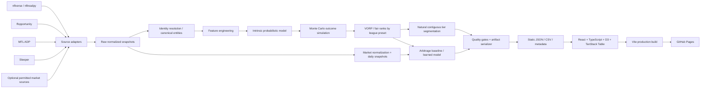

# Architecture

## 1. Architectural thesis

The product is a **build-time data application**, not a runtime web service.

All expensive, failure-prone, or licensed data access occurs in Python jobs. The browser receives only validated public artifacts needed to render the current experience. This makes the deployment cheap, reproducible, cacheable, and easy to host on GitHub Pages.

## 2. High-level system



## 3. Hard boundaries

### 3.1 Intrinsic boundary

Allowed into intrinsic features:

- football performance and opportunity history
- age/experience
- roster/team movement
- depth-chart information available at the anchor
- draft capital / combine measures
- injury/status information available at the anchor
- legally usable advanced metrics

Forbidden:

- ADP
- ECR/expert rank
- FantasyCalc market values
- market-derived ownership/trade value
- any arbitrage output

Enforce the boundary in code by keeping market-source modules outside the intrinsic feature package and adding a forbidden-feature test.

**Phase-5 implementation.** The boundary is now checked by walking the import graph, not by inspection. `tests/contract/test_architecture_boundary.py` parses every module under `ffdraft.features`, `ffdraft.labels`, `ffdraft.modeling`, `ffdraft.simulation`, `ffdraft.tiers` and `ffdraft.scoring`, follows first-party imports transitively — function-local imports included, since a deferred import is still an import — and fails on any path that reaches `ffdraft.market`, `ffdraft.sources.market` or `ffdraft.arbitrage`. It also asserts the *allowed* direction exists, so a market layer that touched nothing could not pass by being inert.

That test found a real edge on its first run: the Sleeper status capture imported the market snapshot store for its append-only primitives, which pulled `pipeline.current` and `modeling.frozen` across the line. The retention mechanism — immutable timestamped directories, content hashes, deterministic bytes — is a filesystem discipline rather than market data, so it moved to `ffdraft.retention`, which both packages build on without either importing the other.

### 3.2 Browser boundary

The frontend may load only generated public files under `public/data/` (or Vite-equivalent asset paths). It must not directly call MFL/Sleeper/FantasyCalc/nflverse in the critical render path.

> **Phase-9A note.** "No third party in the critical render path" includes assets, not only data.
> The design source links its two typefaces from Google Fonts; they are vendored under
> `web/src/assets/fonts/` instead, referenced by relative `url()` so Vite fingerprints them and
> rewrites the paths under any base. `web/tests/e2e/board.spec.ts` fails any request that leaves
> localhost, which is what turns this section into a check rather than a convention — and is
> what made the decision for us.

### 3.3 Benchmark boundary

Benchmark-only source data must never be serialized into public artifacts unless its current license/terms explicitly permit redistribution.

## 4. Target repository structure

```text
.
├── AGENTS.md
├── CLAUDE.md
├── PRD.md
├── TASKS.md
├── SESSION_STATE.md
├── README.md
├── pyproject.toml
├── uv.lock
├── package.json
├── package-lock.json                 # or one consistently chosen JS lockfile
├── vite.config.ts
├── tsconfig.json
├── config/
│   ├── league-defaults.yaml
│   └── source-registry.yaml
├── schemas/
│   ├── player_projection.schema.json
│   ├── market_snapshot.schema.json
│   ├── tier_record.schema.json
│   ├── arbitrage_record.schema.json
│   └── build_metadata.schema.json
├── src/
│   └── ffdraft/
│       ├── cli.py
│       ├── config.py
│       ├── identity/
│       ├── sources/
│       ├── contracts/
│       ├── features/
│       ├── scoring/
│       ├── modeling/
│       ├── simulation/
│       ├── tiers/
│       ├── arbitrage/
│       ├── artifacts/
│       └── quality/
├── tests/
│   ├── fixtures/
│   ├── unit/
│   ├── integration/
│   ├── data_quality/
│   ├── leakage/
│   └── model/
├── models/
│   ├── production/
│   ├── cards/
│   └── metrics/
├── data/
│   ├── fixtures/
│   └── README.md                     # real daily market snapshots may live on data branch
├── web/
│   ├── src/
│   │   ├── app/
│   │   ├── components/
│   │   ├── charts/
│   │   ├── tables/
│   │   ├── data/
│   │   ├── state/
│   │   └── styles/
│   ├── tests/
│   └── public/data/                  # generated in build; normally gitignored on main
├── scripts/
│   ├── source_probe.py
│   ├── build_historical.py
│   ├── train_intrinsic.py
│   ├── train_arbitrage.py
│   └── build_public.py
├── docs/
│   └── ...
└── .github/workflows/
    ├── ci.yml
    ├── daily-refresh.yml
    └── retrain.yml
```

The implementation agent may make modest naming changes, but subsystem boundaries must remain recognizable.

> **Phase-1 deltas from the sketch above**, all additive:
>
> - `src/ffdraft/pipeline/` holds pipeline wiring, currently the network-free fixture mini-pipeline. Its deterministic stub valuation lives there rather than in `modeling/`, `simulation/` or `tiers/` precisely so it cannot be mistaken for the real thing.
> - `src/ffdraft/paths.py`, `secret.py` and `timeutil.py` are small cross-cutting utilities.
> - TypeScript configuration is split into `tsconfig.json` (project references), `tsconfig.app.json` (the browser sources) and `tsconfig.node.json` (the build tooling), which is the standard Vite layout.
> - `tests/` grew `contract/`, `data_quality/` and `leakage/` alongside `unit/` and `integration/`, matching `docs/TEST_STRATEGY.md` section 2.
> - `config/identity-aliases.yaml` holds human-reviewed identity aliases (ADR-019).
> - `schemas/artifact_envelope.schema.json` describes the shared artifact wrapper (ADR-020).
>
> **Phase-2 deltas**, also additive:
>
> - `src/ffdraft/anchors.py` — the draft-time anchor rule (ADR-021). It sits at the package root rather than inside `features/` because the leakage tests, the labels and the quality report all key off it.
> - `src/ffdraft/scoring/` — the one authoritative fantasy scoring engine and the season horizon.
> - `src/ffdraft/features/` — dictionary, eligibility, lagged aggregates, assembly, source loading and the data-quality report.
> - `src/ffdraft/labels/` — actual fantasy points and realized VORP.
> - `src/ffdraft/simulation/allocation.py` — starter/FLEX allocation and replacement baselines, written now so Phase 4 wraps a sampler around it rather than reimplementing it.
> - `src/ffdraft/leakage.py` — the ten automated leakage audits, production code because the build runs them before writing and `validate-historical` runs them again over a dataset on disk.
> - `src/ffdraft/quality/semantic.py` — the semantic/domain drift layer.
> - `src/ffdraft/pipeline/historical.py` — the historical build, alongside the Phase-1 fixture pipeline.
> - `scripts/capture_source_schemas.py` — records upstream schemas for the Phase-2 loaders in the Phase-0 format.
> - `docs/FEATURE_DICTIONARY.md` — generated from the dictionary module, with a test asserting it is current.
>
> **Phase-3 deltas**, also additive:
>
> **Phase-4 additions.**
>
> - `src/ffdraft/modeling/rules.py` — every frozen Phase-4 decision rule in one module,
>   committed before its evidence existed (ADR-030).
> - `src/ffdraft/modeling/calibration.py` — the isotonic monotonicity projection, the
>   split-conformal quantile shift, and the horizon target scale.
> - `src/ffdraft/modeling/gaussian.py` — the normal CDF and its inverse, written against
>   NumPy for the copula (ADR-024 keeps SciPy out of production).
> - `src/ffdraft/modeling/distribution.py` — the stage-B study that chose the production
>   predictive distribution.
> - `src/ffdraft/modeling/production.py` — training, serializing and serving a versioned
>   model artifact. Text boosters plus JSON metadata; no pickle anywhere.
> - `src/ffdraft/modeling/frozen.py` — the freeze checkpoint: the production system as
>   constants, committed before the final holdout was opened.
> - `src/ffdraft/modeling/cards.py` — the generated model card and tier-method report.
> - `src/ffdraft/pipeline/current.py` — the current-season build, whose information cutoff is
>   the build timestamp rather than a future draft anchor.
>
> - `src/ffdraft/modeling/` — the evaluation harness: the sealed holdout, the fold generator and window policies, the versioned core feature set, fold-local preprocessing and residual quantiles, the B0/B1 baselines, the Q1 LightGBM quantile candidate, metrics, the paired bootstrap, the frozen promotion gate, and experiment orchestration and reporting. It knows how to *evaluate* a model on the Phase-2 dataset; it fetches nothing, writes no public artifact and does not know what a tier is.
> - `tests/model/` — the Phase-3 suite, driven by a synthetic modelling table so it runs without the gitignored historical dataset.
> - `docs/experiments/phase3-intrinsic-baselines/` — the machine-readable and human-readable experiment reports, committed as evidence in the same way `docs/source-probes/` holds the Phase-0 probe.

## 5. Python package boundaries

### `sources/`

One adapter per source. Responsibilities:

- network call / file download
- retry/timeouts
- raw schema normalization
- retrieval timestamp
- source metadata

Not responsible for cross-source identity or model feature engineering.

Suggested interface:

```python
class SourceAdapter(Protocol):
    source_id: str
    def fetch(self, *, as_of: datetime, config: SourceConfig) -> SourceBatch: ...
    def validate_raw(self, batch: SourceBatch) -> ValidationReport: ...
```

### `identity/`

Crosswalk canonical IDs. Must emit unresolved/ambiguous diagnostics.

### `contracts/`

Typed internal entities and schema constants. Centralize names/types to avoid accidental dataframe coupling.

### `features/`

Pure-ish transforms from canonical historical snapshots to model matrices. No source HTTP calls here.

> **Phase-2 exception, deliberate.** `features/sources.py` *is* the historical pipeline's only I/O, and it does nothing else: it fetches, hands each payload to its adapter's pure `normalize`, and returns frames. Keeping it here rather than in `sources/` puts the season-window logic next to the feature dictionary that determines it, and `features/build.py` still receives frames with no idea where they came from — which is what lets the whole builder run from fixtures with no network.

### `modeling/`

Includes `build_config.py`, which holds the current build's frozen parameter shape. It lives here rather than in `pipeline/` because `modeling/frozen.py` names it, and importing it from the pipeline dragged the whole current-build dependency tree — the Sleeper status package included — onto the intrinsic side of the import graph.

Training, fold generation, metrics, calibration, artifact versioning. Separate intrinsic and arbitrage subpackages.

### `simulation/`

Sample outcomes from production model distributions, calculate roster allocation/replacement baselines, produce simulated VORP.

> **Phase-4 contents.** `allocation.py` is unchanged from Phase 2 and is still the only
> implementation of who a league starts. `sampler.py` builds the monotone quantile function
> and the deterministic per-player draw streams; `vorp.py` is the draw loop that hands each
> sampled season to the allocation and summarises the result; `study.py` is the development
> study that chose the draw count and the fair-ranking statistic.

### `tiers/`

Contiguous segmentation only. It consumes ranked intrinsic distribution summaries/samples, never market data.

> **Phase-4 contents.** `segmentation.py` (PELT over standardized VORP summaries, plus
> boundary diagnostics), `stability.py` (the draw-resampling bootstrap and the adjusted Rand
> index), `labels.py` (ordinal to letter) and `study.py` (penalty selection and the stability
> gate). Nothing in the package imports a market source, and nothing in it knows what a
> market is.

### `market/`

Cohort catalogue and the frozen sufficiency rule, point-in-time capture, the snapshot manifest, cohort measurement, market trend, and the current price layer. **Market data only**; the boundary in 3.1 is enforced against this package by name.

### `retention/`

The append-only, content-addressed capture store: immutable timestamped directories, fail-closed rewrites, deterministic gzip and JSON. Source-neutral on purpose, so market snapshots and status captures share one mechanism without importing each other.

### `arbitrage/`

The frozen A0 baseline (`rank_gap`, `regional_value_gap`, the within-preset percentile score), the data-quality confidence rubric, the board build, and the generated method card. Realized-surplus targets and a learned model remain out of scope until ADR-010's revisit condition is met.

### `status/`

Current player status: the Sleeper capture, its retention, and the annotation-only `player_status` artifact. Nothing here may enter a prediction (ADR-043).

### `artifacts/`

Convert internal outputs to strict public schemas, JSON, CSV, and metadata.

### `quality/`

Reusable checks, severity levels, source freshness, record completeness, drift, deploy gate.

## 6. Storage strategy

### 6.0 Historical modelling dataset (ADR-023)

`ffdraft build-historical` writes `data/historical/` — three Parquet tables, a JSON and Markdown quality report, a build manifest and a rendered feature dictionary — and that directory is gitignored. The dataset is reproducible from code plus source releases; the manifest records the code SHA, config versions, feature-schema hash, season windows and a content hash per table, so a rebuild that disagrees is detectable. `ffdraft validate-historical` re-runs the leakage and semantic audits over a written dataset and fails if the tables no longer match their manifest.

### 6.1 Main branch

Store:

- code/docs/config
- fixtures
- schemas
- small production model artifacts
- model cards/metrics

Do not store:

- repeated large raw nflverse downloads
- caches
- huge generated browser artifacts if they can be reproduced

### 6.2 Historical market snapshots

Daily ADP history is analytically valuable and may not be reconstructable later. Recommended design:

- use an orphan or dedicated `data` branch containing compact partitioned Parquet/CSV snapshots and a manifest;
- write only after source validation;
- use a bot commit message that does not trigger unrelated CI;
- never force-push/rewrite published snapshot history;
- include source terms decision and schema version in manifest.

Alternative acceptable designs: versioned GitHub release assets or another free append-only artifact store, provided history survives workflow retention and remains reproducible. Normal transient GitHub Actions artifacts alone are not sufficient as the sole historical market store.

**Phase-5 implementation (ADR-038), as amended in Phase 7 (ADR-049).** Captures live on a dedicated long-lived branch named **`market-data`**, never merged into a code branch and never rebased. Phase 7 moved that branch out of this repository and into a **separate private repository**, `jeisey/jeisey-tiers-market-data`, where it is the default and only branch — because the application repository became public and GitHub visibility is a property of a repository, not of a branch. Nothing else about the store changed; a checkout is byte-identical to what the old branch held. The layout is:

```text
market/<source_id>/<season>/<YYYY-MM-DDTHH-MM-SSZ>/
    manifest.json                        # provenance, filters, hashes, resolution counts
    players.raw.json.gz                  # exact MFL player-directory payload bytes
    cohorts/<cohort_id>/adp.raw.json.gz  # exact MFL ADP payload bytes, one per cohort
    market.normalized.json.gz            # normalized, identity-resolved quotes
status/<source_id>/<season>/<YYYY-MM-DDTHH-MM-SSZ>/
    manifest.json
    status.normalized.json.gz            # normalized Sleeper current-status rows
```

A retained directory is immutable: a new timestamp appends, an identical re-capture is an idempotent no-op, and a differing rewrite fails closed and writes nothing. Every file carries a SHA-256 in its manifest, and `ffdraft validate-market-history` re-hashes them. `source_as_of_utc` is always null for MyFantasyLeague — its response `timestamp` is generation time, retained as vendor metadata and never promoted to a data-as-of claim.

The `status/` prefix applies the same discipline to Sleeper captures, for a different reason: not as future training data, which ADR-044 forbids, but so a status artifact can be rebuilt offline and byte-for-byte from evidence rather than from a feed that has since moved. Only the normalized rows are retained; the 14.6 MB raw player map is not.

The store is never included in a release archive or a Pages publish, and it now cannot be: it is not in this repository. `daily-refresh.yml` asserts the Pages artifact's contents before uploading it, so the boundary is a check rather than a promise.

The repository address is recorded in exactly one place — `config/source-registry.yaml`'s `market_history_repository` — and read from there by `.github/actions/market-data-store`, which is the only way any workflow checks the store out. `tests/unit/test_workflows.py` fails if a workflow grows the literal or touches the credential outside that action.

### 6.3 What "offline" means in this repository

Used throughout `docs/OPERATIONS.md` and `SESSION_STATE.md`, and worth stating once rather than implying:

> **Offline** means *the computation does not call a vendor, because it consumes source bytes that were already retained.* It does not mean local-only, and it does not mean unreproducible.

There is exactly one durable source-history store and it is in Git. The topology is:

```text
jeisey/jeisey-tiers                PUBLIC
  main                             source code, schemas, the production model, the frontend
                                   -> GitHub Pages at /jeisey-tiers/

jeisey/jeisey-tiers-market-data    PRIVATE
  market-data                      immutable timestamped MFL captures and Sleeper captures

a build workspace                  a checkout of both, side by side
  -> web/public/data/              deterministic artifact generation (gitignored output)
  -> web/dist/                     the Vite build, and the whole of the Pages artifact
```

Only two commands touch a vendor: `snapshot-market` and `capture-status`, both of which write into `market-data`. Everything downstream — cohort measurement, `build-current`, `build-arbitrage`, the method cards, artifact validation and the whole frontend build — reads retained bytes and runs with no network at all. That is why a session behind an egress policy can still build and validate the entire product, and why every report can be regenerated and diffed against its committed evidence.

The store is **not** laptop-local state. It is a branch in a repository, cloned beside the working tree:

```bash
git clone https://github.com/jeisey/jeisey-tiers-market-data ../market-data
uv run ffdraft build-current   --store ../market-data
uv run ffdraft build-arbitrage --store ../market-data
```

The store repository is private, so that clone needs an account with access to it — which is the point of ADR-049 rather than a friction to work around. A contributor without that access can still run every fixture-based gate, the whole frontend and the entire test suite; what they cannot do is rebuild the production board, which needs retained vendor bytes.

Phase 7 automates exactly these operations on a clean GitHub runner: check out `main`, check out the store, capture, build, validate, deploy. Nothing about the commands changed when the store moved — only the address `.github/actions/market-data-store` resolves.

## 7. Model registry strategy

Production model directory contains only explicitly promoted artifacts, e.g.:

```text
models/production/intrinsic/
  manifest.json
  qb_ppr.txt
  rb_ppr.txt
  ...
models/production/arbitrage/
  manifest.json
  model.txt                 # only if learned model promoted
```

Manifest fields:

- model family/version
- trained-through season
- training code Git SHA
- feature schema version/hash
- config version
- seed(s)
- fold definition
- primary validation metrics
- calibration summary
- promotion date

Prefer provider-native safe/text model formats where possible over arbitrary pickle deserialization.

## 8. Build artifacts

Two acceptable shapes:

### Shape A — bundled per product

- `tiers.json`
- `arbitrage.json`
- `build_metadata.json`

Each record contains scoring/league preset.

### Shape B — partitioned by preset

- `tiers/ppr-12.json`
- `tiers/half-12.json`
- `arbitrage/ppr-12.json`
- etc.

Choose after measuring browser payload. Keep CSV export paths stable.

> **Chosen for V1: Shape A** (ADR-020). There is no payload to measure yet, and one file per product keeps the loader, the export path and the validator simple; a preset switch is a client-side filter rather than a fetch. Each JSON file is wrapped in the envelope described in `docs/DATA_CONTRACTS.md` section 13.1. Moving to Shape B later changes only the envelope, not the record contracts, so CSV export paths survive the migration.
>
> Phase 1 also emits `projections.json`/`.csv` and `market_snapshot.json` alongside the PRD's minimum set, so every schema in `schemas/` has a serializer and a validator rather than only a definition.

## 9. Configuration strategy

YAML config is declarative; Python validates it at startup.

League configuration controls:

- teams
- scoring preset
- starting slots
- flex eligibility
- supported positions

Source configuration controls:

- allowed state
- criticality
- max staleness
- URL/docs metadata
- attribution
- retry/timeouts

Never hide production-critical constants deep in notebooks/scripts.

## 10. Frontend architecture

React manages:

- app state
- URL state
- artifact loading
- controls
- tables
- accessible details/tooltips

D3 manages:

- scales
- geometry
- layout calculations
- axes where needed

Prefer React-rendered SVG elements driven by D3 scales, rather than opaque D3-owned DOM, unless a chart becomes materially simpler otherwise.

No routing library is required for V1. A single page with tabs and `URLSearchParams` avoids GitHub Pages SPA fallback complexity.

> **Phase-6 implementation (ADR-048).** `web/src/data/` is the whole data layer: `contracts.ts` mirrors the JSON Schemas, `load.ts` fetches and version-checks, `bundle.ts` splits critical (`build_metadata`, `tiers`) from degradable (`arbitrage`, `player_status`, `projections`), `model.ts` builds the indexes and the joins, and `market.ts`, `flags.ts`, `format.ts`, `csv.ts` and `state.ts` hold the derivations, the flag vocabulary, the number formats, the export and the URL state. `web/src/app/` composes; `web/src/charts/` holds the two bespoke charts, which take D3 scales and render React-owned SVG.
>
> URL state is read through `useSyncExternalStore` rather than mirrored into component state, so the address bar and the board cannot disagree for a frame. Every chart is one tab stop with arrow-key movement between marks (`useRovingMarks`), because three hundred tab stops in front of a table is not accessibility.
>
> Added dependencies: TanStack Table v8, `d3-scale`, `d3-array`, `@playwright/test`. Nothing else.

> **Phase-8 revision (ADR-058, ADR-059).** Both bespoke charts moved off SVG. The Tier Board is
> a CSS grid of HUD rows with the P25-P75 interval drawn as a positioned bar, and the Draft
> Rail is the signed rank gap on a symmetric bar; neither needs a continuous scale function, so
> `d3-scale` and `d3-array` were **removed**. The section above still describes the rule for a
> chart that *does* need one — React owns the elements, D3 would own the geometry, and no D3
> selection touches a React-managed node — and that rule is why nothing broke when the
> geometry moved into CSS.
>
> The property that replaced the shared D3 scale is a shared **grid**: the board's axis, each
> tier header's band and each player's interval bar all occupy the same grid column, driven by
> three custom properties on `.tier-board`. That is load-bearing rather than tidy — "adjacent
> tier bands overlap" is a claim about the measurement (ADR-035), and it is only a true
> statement about the picture if all three tracks are the same pixels.
>
> Dependencies now: TanStack Table v8, `@playwright/test`, `@axe-core/playwright`. The
> production bundle is React, ReactDOM and TanStack Table.

> **Phase-9A revision.** The shared grid above is unchanged and is now *measured* rather than
> asserted: `board.spec.ts › draws the tier band on exactly the track the player bars use`
> compares the axis, the tier band and a player's bar at three viewports. It exists because the
> reskin broke that identity twice — once by numbering the strip's grid columns off by one, and
> once with `grid-area: span`, where `span` is a reserved grid keyword, so the declaration was
> dropped silently and two implicit columns appeared. Neither had any other symptom.
>
> The axis is now built as a *lane* — an empty gutter cell plus a body carrying the row grid —
> rather than as a grid restating `gutter + columns`. Restating it dropped the rows' column gap
> and put the ticks 22px wider than the bars they label. If a fourth thing ever has to sit on
> that scale, build it the same way rather than re-deriving the geometry.
>
> Below 768px the same DOM becomes the design source's tier *stack*, and that switch is CSS
> only. The player card's third variant is not: a tab bar is a different accessibility tree, so
> `useMediaQuery` reads the same breakpoint the stylesheet uses and `PlayerDetail` branches on
> it. Those two must move together.
>
> No production dependency was added. Two OFL-licensed font files were vendored (section 3.2).

## 11. Pages base path

The Vite build must work for both:

- project Pages path (`/<repo>/`)
- optional custom domain/root path later

Derive base path from an environment/config value or Vite base. Test generated asset URLs in CI.

> **Phase-6 verification.** `vite.config.ts` reads `VITE_BASE_PATH`, and the end-to-end run builds the site twice — at `/` and at `/jeisey-tiers/` — and serves both from one static server. A test asserts that under the base path the JS and CSS load, `data/*.json` resolves to `/jeisey-tiers/data/...`, the full-CSV link points inside the base path, query state survives a reload, and **no request is made to an absolute `/data/...`**. Phase 7 therefore inherits a proven base path rather than discovering one after a deploy. Nothing here deploys anything.

## 12. Quality gate architecture

Quality checks emit structured records:

```text
check_id
severity: critical|warning|info
status: pass|fail
source_or_stage
observed
expected
message
```

Critical failures block serialization/deploy. Warnings are recorded in `build_metadata.json` and workflow summaries.

Examples of critical checks:

- empty core source
- schema break
- duplicate canonical player-season key
- identity resolution below threshold
- forbidden intrinsic feature found
- model artifact/schema mismatch
- non-monotonic quantiles
- tier missing/duplicate fair ranks
- stale critical source
- JSON Schema validation failure

## 13. Reproducibility

Given:

- repository SHA
- model artifacts
- league/source config versions
- a retained market snapshot
- source historical releases

an agent should be able to regenerate public artifacts within deterministic numeric tolerance.

All stochastic components use recorded seeds. Sort keys/tie behavior must be deterministic.
