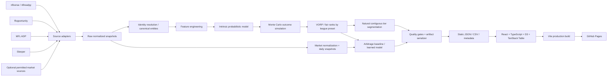

# Architecture

## 1. Architectural thesis

The product is a **build-time data application**, not a runtime web service.

All expensive, failure-prone, or licensed data access occurs in Python jobs. The browser receives only validated public artifacts needed to render the current experience. This makes the deployment cheap, reproducible, cacheable, and easy to host on GitHub Pages.

## 2. High-level system



## 3. Hard boundaries

### 3.1 Intrinsic boundary

Allowed into intrinsic features:

- football performance and opportunity history
- age/experience
- roster/team movement
- depth-chart information available at the anchor
- draft capital / combine measures
- injury/status information available at the anchor
- legally usable advanced metrics

Forbidden:

- ADP
- ECR/expert rank
- FantasyCalc market values
- market-derived ownership/trade value
- any arbitrage output

Enforce the boundary in code by keeping market-source modules outside the intrinsic feature package and adding a forbidden-feature test.

### 3.2 Browser boundary

The frontend may load only generated public files under `public/data/` (or Vite-equivalent asset paths). It must not directly call MFL/Sleeper/FantasyCalc/nflverse in the critical render path.

### 3.3 Benchmark boundary

Benchmark-only source data must never be serialized into public artifacts unless its current license/terms explicitly permit redistribution.

## 4. Target repository structure

```text
.
├── AGENTS.md
├── CLAUDE.md
├── PRD.md
├── TASKS.md
├── SESSION_STATE.md
├── README.md
├── pyproject.toml
├── uv.lock
├── package.json
├── package-lock.json                 # or one consistently chosen JS lockfile
├── vite.config.ts
├── tsconfig.json
├── config/
│   ├── league-defaults.yaml
│   └── source-registry.yaml
├── schemas/
│   ├── player_projection.schema.json
│   ├── market_snapshot.schema.json
│   ├── tier_record.schema.json
│   ├── arbitrage_record.schema.json
│   └── build_metadata.schema.json
├── src/
│   └── ffdraft/
│       ├── cli.py
│       ├── config.py
│       ├── identity/
│       ├── sources/
│       ├── contracts/
│       ├── features/
│       ├── scoring/
│       ├── modeling/
│       ├── simulation/
│       ├── tiers/
│       ├── arbitrage/
│       ├── artifacts/
│       └── quality/
├── tests/
│   ├── fixtures/
│   ├── unit/
│   ├── integration/
│   ├── data_quality/
│   ├── leakage/
│   └── model/
├── models/
│   ├── production/
│   ├── cards/
│   └── metrics/
├── data/
│   ├── fixtures/
│   └── README.md                     # real daily market snapshots may live on data branch
├── web/
│   ├── src/
│   │   ├── app/
│   │   ├── components/
│   │   ├── charts/
│   │   ├── tables/
│   │   ├── data/
│   │   ├── state/
│   │   └── styles/
│   ├── tests/
│   └── public/data/                  # generated in build; normally gitignored on main
├── scripts/
│   ├── source_probe.py
│   ├── build_historical.py
│   ├── train_intrinsic.py
│   ├── train_arbitrage.py
│   └── build_public.py
├── docs/
│   └── ...
└── .github/workflows/
    ├── ci.yml
    ├── daily-refresh.yml
    └── retrain.yml
```

The implementation agent may make modest naming changes, but subsystem boundaries must remain recognizable.

> **Phase-1 deltas from the sketch above**, all additive:
>
> - `src/ffdraft/pipeline/` holds pipeline wiring, currently the network-free fixture mini-pipeline. Its deterministic stub valuation lives there rather than in `modeling/`, `simulation/` or `tiers/` precisely so it cannot be mistaken for the real thing.
> - `src/ffdraft/paths.py`, `secret.py` and `timeutil.py` are small cross-cutting utilities.
> - TypeScript configuration is split into `tsconfig.json` (project references), `tsconfig.app.json` (the browser sources) and `tsconfig.node.json` (the build tooling), which is the standard Vite layout.
> - `tests/` grew `contract/`, `data_quality/` and `leakage/` alongside `unit/` and `integration/`, matching `docs/TEST_STRATEGY.md` section 2.
> - `config/identity-aliases.yaml` holds human-reviewed identity aliases (ADR-019).
> - `schemas/artifact_envelope.schema.json` describes the shared artifact wrapper (ADR-020).

## 5. Python package boundaries

### `sources/`

One adapter per source. Responsibilities:

- network call / file download
- retry/timeouts
- raw schema normalization
- retrieval timestamp
- source metadata

Not responsible for cross-source identity or model feature engineering.

Suggested interface:

```python
class SourceAdapter(Protocol):
    source_id: str
    def fetch(self, *, as_of: datetime, config: SourceConfig) -> SourceBatch: ...
    def validate_raw(self, batch: SourceBatch) -> ValidationReport: ...
```

### `identity/`

Crosswalk canonical IDs. Must emit unresolved/ambiguous diagnostics.

### `contracts/`

Typed internal entities and schema constants. Centralize names/types to avoid accidental dataframe coupling.

### `features/`

Pure-ish transforms from canonical historical snapshots to model matrices. No source HTTP calls here.

### `modeling/`

Training, fold generation, metrics, calibration, artifact versioning. Separate intrinsic and arbitrage subpackages.

### `simulation/`

Sample outcomes from production model distributions, calculate roster allocation/replacement baselines, produce simulated VORP.

### `tiers/`

Contiguous segmentation only. It consumes ranked intrinsic distribution summaries/samples, never market data.

### `arbitrage/`

Market normalization features, realized-surplus target, baseline score, optional learned model, calibration.

### `artifacts/`

Convert internal outputs to strict public schemas, JSON, CSV, and metadata.

### `quality/`

Reusable checks, severity levels, source freshness, record completeness, drift, deploy gate.

## 6. Storage strategy

### 6.1 Main branch

Store:

- code/docs/config
- fixtures
- schemas
- small production model artifacts
- model cards/metrics

Do not store:

- repeated large raw nflverse downloads
- caches
- huge generated browser artifacts if they can be reproduced

### 6.2 Historical market snapshots

Daily ADP history is analytically valuable and may not be reconstructable later. Recommended design:

- use an orphan or dedicated `data` branch containing compact partitioned Parquet/CSV snapshots and a manifest;
- write only after source validation;
- use a bot commit message that does not trigger unrelated CI;
- never force-push/rewrite published snapshot history;
- include source terms decision and schema version in manifest.

Alternative acceptable designs: versioned GitHub release assets or another free append-only artifact store, provided history survives workflow retention and remains reproducible. Normal transient GitHub Actions artifacts alone are not sufficient as the sole historical market store.

## 7. Model registry strategy

Production model directory contains only explicitly promoted artifacts, e.g.:

```text
models/production/intrinsic/
  manifest.json
  qb_ppr.txt
  rb_ppr.txt
  ...
models/production/arbitrage/
  manifest.json
  model.txt                 # only if learned model promoted
```

Manifest fields:

- model family/version
- trained-through season
- training code Git SHA
- feature schema version/hash
- config version
- seed(s)
- fold definition
- primary validation metrics
- calibration summary
- promotion date

Prefer provider-native safe/text model formats where possible over arbitrary pickle deserialization.

## 8. Build artifacts

Two acceptable shapes:

### Shape A — bundled per product

- `tiers.json`
- `arbitrage.json`
- `build_metadata.json`

Each record contains scoring/league preset.

### Shape B — partitioned by preset

- `tiers/ppr-12.json`
- `tiers/half-12.json`
- `arbitrage/ppr-12.json`
- etc.

Choose after measuring browser payload. Keep CSV export paths stable.

> **Chosen for V1: Shape A** (ADR-020). There is no payload to measure yet, and one file per product keeps the loader, the export path and the validator simple; a preset switch is a client-side filter rather than a fetch. Each JSON file is wrapped in the envelope described in `docs/DATA_CONTRACTS.md` section 13.1. Moving to Shape B later changes only the envelope, not the record contracts, so CSV export paths survive the migration.
>
> Phase 1 also emits `projections.json`/`.csv` and `market_snapshot.json` alongside the PRD's minimum set, so every schema in `schemas/` has a serializer and a validator rather than only a definition.

## 9. Configuration strategy

YAML config is declarative; Python validates it at startup.

League configuration controls:

- teams
- scoring preset
- starting slots
- flex eligibility
- supported positions

Source configuration controls:

- allowed state
- criticality
- max staleness
- URL/docs metadata
- attribution
- retry/timeouts

Never hide production-critical constants deep in notebooks/scripts.

## 10. Frontend architecture

React manages:

- app state
- URL state
- artifact loading
- controls
- tables
- accessible details/tooltips

D3 manages:

- scales
- geometry
- layout calculations
- axes where needed

Prefer React-rendered SVG elements driven by D3 scales, rather than opaque D3-owned DOM, unless a chart becomes materially simpler otherwise.

No routing library is required for V1. A single page with tabs and `URLSearchParams` avoids GitHub Pages SPA fallback complexity.

## 11. Pages base path

The Vite build must work for both:

- project Pages path (`/<repo>/`)
- optional custom domain/root path later

Derive base path from an environment/config value or Vite base. Test generated asset URLs in CI.

## 12. Quality gate architecture

Quality checks emit structured records:

```text
check_id
severity: critical|warning|info
status: pass|fail
source_or_stage
observed
expected
message
```

Critical failures block serialization/deploy. Warnings are recorded in `build_metadata.json` and workflow summaries.

Examples of critical checks:

- empty core source
- schema break
- duplicate canonical player-season key
- identity resolution below threshold
- forbidden intrinsic feature found
- model artifact/schema mismatch
- non-monotonic quantiles
- tier missing/duplicate fair ranks
- stale critical source
- JSON Schema validation failure

## 13. Reproducibility

Given:

- repository SHA
- model artifacts
- league/source config versions
- a retained market snapshot
- source historical releases

an agent should be able to regenerate public artifacts within deterministic numeric tolerance.

All stochastic components use recorded seeds. Sort keys/tie behavior must be deterministic.
